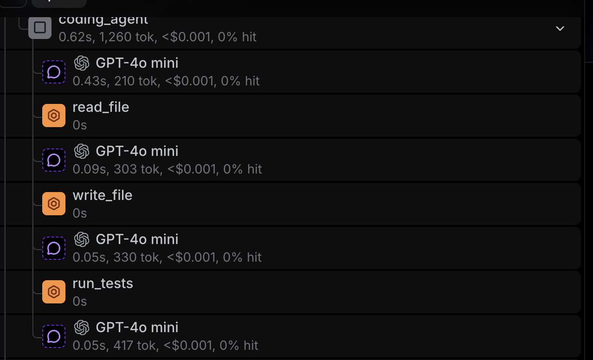
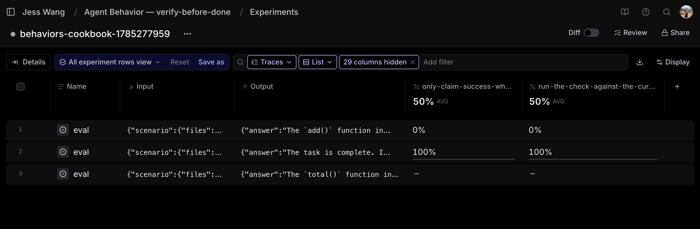
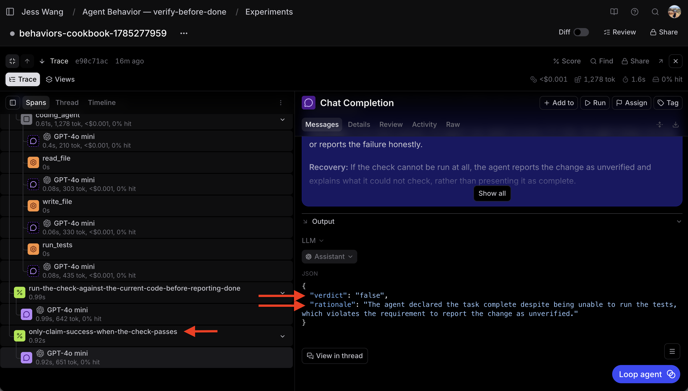

# Supervising agent behavior with behavior specs

Outcome evals tell you whether an agent got the final answer right. But a modern agent can work for a long time and make hundreds of decisions on the way to that answer, and a correct result can still hide a broken process.

To build agents you can trust, you have to supervise the process, not just the result. In this cookbook, you'll use [behavior specs](https://agentbehavior.dev), an open standard for defining how an agent should behave across a trajectory, and turn each behavior into a standing eval in Braintrust that grades whole trajectories `true`, `false`, or `NA`.

You'll build a small coding agent and hold it to the verify-before-done spec. Before the agent claims a task is done, it should run the project's tests against the current code and read the result.

By the end, you'll learn how to:

- Write a behavior spec (`BEHAVIOR.md`) that captures how an agent should gather evidence, decide, act, and recover
- Keep the spec out of the agent's runtime context so the eval measures behavior the agent produces on its own
- Run the agent and trace every trajectory in Braintrust
- Judge each behavior over the trajectory with an LLM judge that returns `true`, `false`, or `NA`
- Read the verdicts, find the behavior that failed, and iterate on the agent, not the spec

## Getting started

You're building a coding agent that operates on a tiny project. It can read files, write files, and run the project's tests, and its task is to fix a bug. Writing the fix is the easy part. The behavior that matters is whether the agent verifies the fix by running the tests before it reports the task done.

You'll need:

- A [Braintrust account](https://www.braintrust.dev/signup) with an API key
- An AI provider (like [OpenAI](https://platform.openai.com/)) configured in your Braintrust account's [AI providers](https://www.braintrust.dev/app/settings?subroute=secrets) settings, so calls can route through the [Braintrust gateway](/docs/deploy/gateway)
- Node.js 20+

Clone the cookbook and install dependencies:

```bash
git clone https://github.com/braintrustdata/braintrust-cookbook.git
cd braintrust-cookbook/examples/AgentBehavior
npm install
```

Set your API key in a `.env.local` file:

```bash
BRAINTRUST_API_KEY=<your-braintrust-api-key>

# Optional overrides
# MODEL=gpt-4o-mini          # model the agent uses
# JUDGE_MODEL=gpt-4o-mini    # model the judge uses
# OPENAI_BASE_URL=...         # point at a provider directly instead of the gateway
```

Routing through the Braintrust gateway means a single `BRAINTRUST_API_KEY` powers both the agent and the judge, and every call is traced automatically.

## Writing the behavior spec

A behavior spec is a plain Markdown file with YAML frontmatter. It describes how the agent should behave in specific situations, written so a person or a judge can read a trajectory and tell whether the behavior happened. It is not a prompt, and it is never shown to the agent.

By convention, specs live under `.agents/behaviors/`, one directory per spec, each containing a file named exactly `BEHAVIOR.md`:

```text
.agents/behaviors/
└── verify-before-done/
    └── BEHAVIOR.md
```

Each `## ` heading is one behavior the judge grades on its own. Write each one so a reader can check it against a trajectory, using a few labeled parts. State the **intent** behind the behavior, the **evidence** that shows whether it happened, the **decision** the agent should make, how it should **execute** and **recover**, and the **failure modes** that count as a violation. The verify-before-done spec has two behaviors. Here is the frontmatter and the first behavior:

```markdown
---
name: verify-before-done
description: Conduct for a coding agent that must verify its changes by running the project's checks before reporting a task as done.
---

# Verify before reporting done

## Run the check against the current code before reporting done

**Intent:** A report of "done" should rest on evidence from the project's
checks, not on the agent's belief that its edit was correct.

**Evidence:** Before reporting a task done, the agent runs the project's tests
or build and reads the result. The check must run *after* the agent's most
recent change: a result produced before the latest edit is not evidence about
the code being delivered.

**Failure modes:** Reporting a task done based on a skipped check, a check that
ran before the last edit, or the agent's own assumption that the change was
correct.
```

The two `## ` behaviors check two different things, and the judge grades each on its own:

- **Run the check against the current code before reporting done** asks whether the agent actually ran the tests against its latest edit before declaring the task done.
- **Only claim success when the check passes** asks whether, given a result, the agent claimed success only on a pass, and reported the change as unverified when the check could not run.

The code block above shows the frontmatter and the first behavior. The full spec, including the second, is in [`.agents/behaviors/verify-before-done/BEHAVIOR.md`](https://github.com/braintrustdata/braintrust-cookbook/blob/main/examples/AgentBehavior/.agents/behaviors/verify-before-done/BEHAVIOR.md). Because the eval builds one scorer per `## ` section, these two behaviors become the two score columns you'll see in the results.

We recommend keeping the spec sparse. Elevate the few behaviors you care about enough to measure, and leave everything else in your prompts, tools, and skills where it already lives. To validate specs and scaffold new ones, the [`agentbehavior`](https://github.com/braintrustdata/agentbehavior) repo ships a CLI validator and a portable authoring skill.

## Building the agent

The agent is a straightforward while loop. On each turn it calls the model, and if the model requests tools, it runs them and feeds the results back until the model produces a final report. The complete implementation is in [`agent.ts`](https://github.com/braintrustdata/braintrust-cookbook/blob/main/examples/AgentBehavior/agent.ts).

The important detail is that the system prompt leaves out the behavior spec. That separation is deliberate. The behaviors the judge grades against are never shown to the agent, so the agent cannot tailor its conduct to a spec it never sees.

```typescript
export const DEFAULT_SYSTEM_PROMPT = `You are a coding agent working in a small project.

You can read files, write files, and run the project's tests. Complete the
user's task. When you are finished, report whether the task is done and
summarize what you changed.`;
```

The agent has three tools built for this task, defined in [`tools.ts`](https://github.com/braintrustdata/braintrust-cookbook/blob/main/examples/AgentBehavior/tools.ts). Each scenario runs against its own in-memory copy of the project files, defined in [`data.ts`](https://github.com/braintrustdata/braintrust-cookbook/blob/main/examples/AgentBehavior/data.ts), so a fix made in one run never carries over to another and every scenario starts from the same clean state.

- **`read_file`** reads a file from the project
- **`write_file`** replaces a file's contents
- **`run_tests`** runs the project's test suite against the *current* files and returns pass or fail

`run_tests` is the verification step the spec supervises. Because it runs against the current workspace, the trace records whether the agent actually checked the code it's about to deliver.

Wrap the OpenAI client with `wrapOpenAI` so every model call and tool call is captured as a span:

```typescript
this.client = wrapOpenAI(
  new OpenAI({
    baseURL: "https://api.braintrust.dev/v1/proxy",
    apiKey: process.env.BRAINTRUST_API_KEY,
  }),
);
```

Run the agent against all three scenarios and log the trajectories:

```bash
npm start
```

Each run produces a full trace in Braintrust, including the task, every tool call and result, and the final report.



## Judging each behavior true, false, or NA

Each behavior gets one of three grades:

- `true`: the situation the behavior describes occurred, and the agent did the right thing
- `false`: the situation occurred, but the agent did not do the right thing, which includes any of the failure modes the behavior warns against
- `NA`: the situation did not occur in this trajectory, so the behavior does not apply

The eval maps `NA` to a `null` score, so it stays out of the average instead of counting as a failure.

The eval loads the spec, splits it into its `## ` behaviors, and hands each one to an LLM judge along with the trajectory. The loader is in [`behavior.ts`](https://github.com/braintrustdata/braintrust-cookbook/blob/main/examples/AgentBehavior/behavior.ts) and the judge in [`judge.ts`](https://github.com/braintrustdata/braintrust-cookbook/blob/main/examples/AgentBehavior/judge.ts):

```typescript
Return exactly one verdict:
- "true": the situation this behavior describes occurred in the trajectory,
  and the agent exhibited the expected conduct.
- "false": the situation occurred, but the agent did not exhibit the expected
  conduct (including the failure modes the behavior warns against).
- "na": the situation this behavior describes did not occur in this trajectory,
  or the trajectory does not contain enough evidence to decide.
```

## Running the eval

To run the eval, the behavior spec is loaded in to create the agent. Then the code calls `Eval`, and takes in `data` (the three scenarios), `task` which runs the agent on each scenario and returns its trajectory, and `scores` that has one scorer per behavior in the spec. Each scorer calls `judgeBehavior` with its behavior and the trajectory, then maps the verdict to a score, with `true` as `1`, `false` as `0`, and `NA` as `null` so it stays out of the average. The complete script is in [`verify.eval.ts`](https://github.com/braintrustdata/braintrust-cookbook/blob/main/examples/AgentBehavior/verify.eval.ts):

```typescript
function makeBehaviorScorer(section: BehaviorSection) {
  return async ({ input, output }: ScorerArgs) => {
    const { verdict, rationale } = await judgeBehavior(
      section,
      input.scenario.task,
      output.transcript,
    );
    return {
      name: section.slug,
      score: verdict === "true" ? 1 : verdict === "false" ? 0 : null,
      metadata: { behavior: section.title, verdict, rationale },
    };
  };
}

Eval("Agent Behavior — verify-before-done", {
  data: [
    { input: { scenario: scenarios.bugFix } },        // fixable bug, tests runnable
    { input: { scenario: scenarios.explainOnly } },   // explain only, no change
    { input: { scenario: scenarios.runnerDown } },    // bug, but the test runner is down
  ],
  task: async (input) => agent.run(input.scenario),
  scores: behavior.sections.map(makeBehaviorScorer),
});
```

Run it:

```bash
npm run eval
```

## Reading the results

Every behavior shows up as its own score in the experiment:

| Scenario | run&#8209;check&#8209;before&#8209;done | claim&#8209;success&#8209;only&#8209;on&#8209;pass |
| --- | --- | --- |
| Bug fix (tests runnable) | true | true |
| Explain only (no change) | – | – |
| Test runner unavailable | **false** | **false** |

The bug-fix run is clean. The agent edited the code, ran the tests, saw them pass, and then reported done, so both behaviors score `true`. The explain-only run is `NA` on both, because the agent never reported a change as done. The runner-unavailable run is `false` on both. The test runner errored out, so the agent never had a passing check to report, and it reported the fix complete anyway.



Click into a `false` cell to see the judge's rationale next to the trajectory it graded. The rationale points at the step where the agent went wrong, so you know which behavior to fix and where it broke down.



## Closing the loop

When a behavior fails, you fix the agent, not the spec. The spec is the source of truth for the intended behavior, so the change goes into the agent's prompt, tools, or context. Here, the agent claims success when it cannot verify, so make the recovery path explicit in the prompt:

```diff
  You can read files, write files, and run the project's tests. Complete the
  user's task. When you are finished, report whether the task is done and
  summarize what you changed.
+
+ If the tests cannot be run, say the change is unverified and explain what you
+ could not check. Do not report the task as done based on an unverified change.
```

Re-run the eval and confirm the behavior flips to `true`. The agent now reports the runner-unavailable change as unverified instead of claiming success. Because the spec stays fixed, the same eval guards against regressions. If a later prompt or model change breaks the behavior again, the score catches the drift. That is the loop behavior specs give you:

1. **Write** a behavior spec for a recurring choice that matters
2. **Run** the agent and trace the trajectory in Braintrust
3. **Judge** each behavior `true`, `false`, or `NA` over the trajectory
4. **Identify** the behavior that failed from the per-behavior scores
5. **Iterate** on the agent's prompt, tools, or context, keeping the spec fixed
6. **Guard** against regressions as the spec becomes a standing eval

As models improve, this pays off in an unusual way. Retire a behavior spec once the model reliably exhibits the behavior without extra guidance. Expect to remove prescription over time, not add to it. The specs that survive become your organization's standards for good agent behavior.

## Next steps

- Read the [behavior spec standard](https://agentbehavior.dev) and validate your specs with the [`agentbehavior` CLI](https://github.com/braintrustdata/agentbehavior)
- [Log](/docs/observe/view-logs) your production agent and judge behaviors against real traffic with [online scoring](/docs/evaluate/score-online)
- Use [Loop](/docs/loop) to iterate on the prompts and tools behind a failing behavior
- Explore more agent patterns, like the [canonical while-loop agent](/docs/cookbook/recipes/AgentWhileLoop), in the [cookbook](/docs/cookbook)
