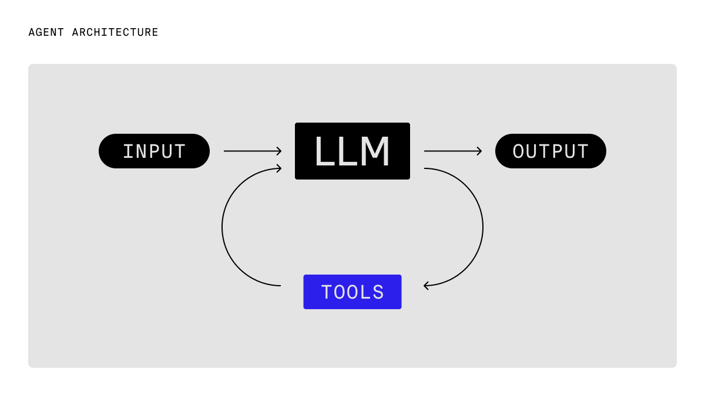
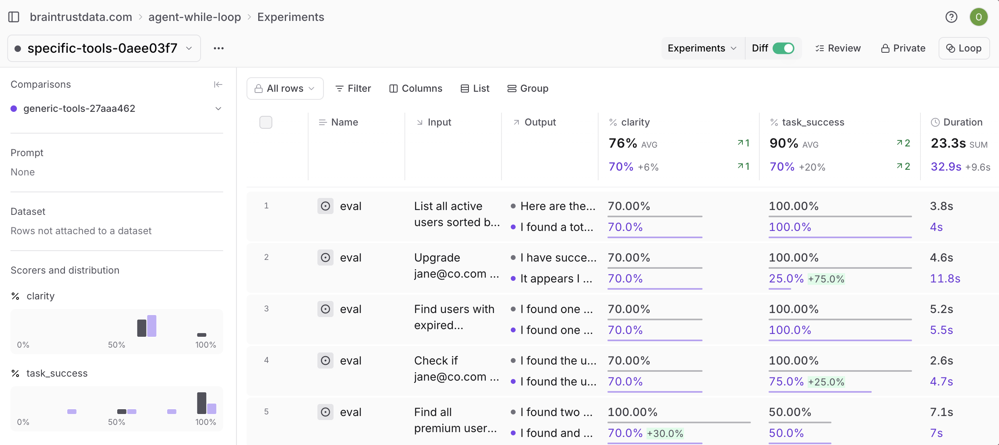

# Building reliable AI agents

In this cookbook, we'll implement the canonical agent architecture: a while loop with tools. This pattern, described on our [blog](/blog/agent-while-loop), provides a clean, debuggable foundation for building production-ready AI agents.

By the end of this guide, you'll learn how to:

- Implement the canonical while loop agent pattern
- Build purpose-designed tools that reduce cognitive load
- Add comprehensive tracing with Braintrust
- Run evaluations to measure agent performance
- Compare different architectural approaches

## The canonical agent architecture

The core pattern we'll follow is straightforward:



In code, that roughly translates to:

```typescript
while (!done) {
  const response = await callLLM();
  messages.push(response);
  if (response.toolCalls) {
    messages.push(
      ...(await Promise.all(response.toolCalls.map((tc) => tool(tc.args)))),
    );
  } else {
    done = true;
  }
}
```

This pattern is surprisingly powerful: the loop is easy to understand and debug, scales naturally to complex multi-step workflows, and provides clear hooks for logging and evaluation without framework overhead.

## Getting started

To get started, you'll need [Braintrust](https://www.braintrust.dev/signup) and [OpenAI](https://platform.openai.com/) accounts, along with their corresponding API keys. Plug your OpenAI API key into your Braintrust account's [AI providers](https://www.braintrust.dev/app/settings?subroute=secrets) configuration. You can also add an API key for any other AI provider you'd like, but be sure to change the code to use that model. Lastly, set up your `.env.local` file:

```
BRAINTRUST_API_KEY=<your-braintrust-api-key>
OPENAI_API_KEY=<your-openai-key>  # Optional if using Braintrust proxy
```

To install the necessary dependencies, start by downloading [npm](https://docs.npmjs.com/downloading-and-installing-node-js-and-npm) or a package manager of your choice. This example includes a complete [`package.json`](https://github.com/braintrustdata/braintrust-cookbook/blob/main/examples/AgentWhileLoop/package.json) file with all the required dependencies and helpful scripts.

Install dependencies by running:

```bash
npm install
```

## Building the agent

Let's start by implementing the core agent class. The complete implementation is available in [`agent.ts`](https://github.com/braintrustdata/braintrust-cookbook/blob/main/examples/AgentWhileLoop/agent.ts), but let's focus on the key parts.

First, we define our tool interface and agent options:

```typescript
export interface Tool<T = unknown> {
  name: string;
  description: string;
  parameters: z.ZodSchema<T>;
  execute: (args: T) => Promise<string>;
}

export interface AgentOptions {
  model?: string;
  systemPrompt?: string;
  maxIterations?: number;
  tools: Tool<unknown>[];
  openaiApiKey?: string;
}
```

The heart of the agent is the while loop pattern:

```typescript
async run(userMessage: string): Promise<string> {
  return traced(async (span) => {
    const messages = [
      { role: "system", content: this.systemPrompt },
      { role: "user", content: userMessage },
    ];

    let iterations = 0;
    let done = false;

    // The canonical while loop
    while (!done && iterations < this.maxIterations) {
      const response = await this.client.chat.completions.create({
        model: this.model,
        messages,
        tools: this.formatToolsForOpenAI(),
        tool_choice: "auto",
      });

      const message = response.choices[0].message;
      messages.push(message);

      if (message.tool_calls && message.tool_calls.length > 0) {
        // Execute tools and add results to conversation
        const toolResults = await Promise.all(
          message.tool_calls.map(tc => this.executeTool(tc))
        );
        messages.push(...toolResults);
      } else if (message.content) {
        done = true;
      }

      iterations++;
    }

    return this.extractFinalResponse(messages);
  });
}
```

The while loop continues until either:

- The LLM responds without tool calls (indicating it's done)
- We hit the maximum iteration limit

Each iteration is traced individually with Braintrust, giving us detailed observability into the agent's decision-making process.

## Designing purpose-built tools

One of the most critical aspects of building reliable agents is tool design. Rather than creating generic API wrappers, we design tools specifically for the agent's mental model.

Here's what not to do - a generic email API wrapper:

```typescript
// DON'T DO THIS - Generic email API wrapper
const BadEmailSchema = z.object({
  to: z.string().describe("Recipient email address"),
  from: z.string().describe("Sender email address"),
  subject: z.string().describe("Email subject line"),
  body: z.string().describe("Email body content"),
  cc: z.array(z.string()).optional().describe("CC recipients"),
  bcc: z.array(z.string()).optional().describe("BCC recipients"),
  replyTo: z.string().optional().describe("Reply-to address"),
  headers: z.record(z.string()).optional().describe("Custom email headers"),
  // ... 10+ more parameters
});
```

Instead, create purpose-built tools focused on the specific task:

```typescript
// DO THIS - Purpose-built for customer notifications
const NotifyCustomerSchema = z.object({
  customerEmail: z.string().describe("Customer's email address"),
  message: z.string().describe("The update message to send to the customer"),
});

export const notifyCustomerTool: Tool<z.infer<typeof NotifyCustomerSchema>> = {
  name: "notify_customer",
  description:
    "Send a notification email to a customer about their order or account",
  parameters: NotifyCustomerSchema,
  execute: async ({ customerEmail, message }) => {
    const result = await UserService.notifyUser({
      email: customerEmail,
      message,
    });
    return result.message;
  },
};
```

The purpose-built approach reduces cognitive load, handles infrastructure complexity internally, and provides clear feedback to guide the agent's next actions.

### Building customer service tools

Our customer service agent needs four purpose-built tools, each designed for the agent's specific workflow rather than as generic API wrappers. The complete implementation is available in [`tools.ts`](https://github.com/braintrustdata/braintrust-cookbook/blob/main/examples/AgentWhileLoop/tools.ts).

- **`notify_customer`** - Send targeted notifications (not generic email API)
- **`search_users`** - Find users with business-relevant filters
- **`get_user_details`** - Get comprehensive user information
- **`update_subscription`** - Handle subscription changes

Each tool returns human-readable output that guides the agent toward logical next steps:

```typescript
export const searchUsersTool: Tool<z.infer<typeof SearchUsersSchema>> = {
  name: "search_users",
  description: "Search for users by various criteria",
  parameters: SearchUsersSchema,
  execute: async ({ query, subscriptionPlan, subscriptionStatus }) => {
    const result = await UserService.searchUsers({
      query,
      subscriptionPlan,
      subscriptionStatus,
    });

    // Return human-readable output that guides next actions
    return (
      result.formatted +
      "\n\nNeed more details? Use 'get_user_details' with the user's email."
    );
  },
};
```

## Running the agent

Now let's put it all together and create a customer service agent:

```typescript
import { WhileLoopAgent } from "./agent.js";
import { getAllTools } from "./tools.js";
import { initLogger } from "braintrust";

// Initialize Braintrust logging
const logger = initLogger("CustomerServiceAgent");

const agent = new WhileLoopAgent({
  model: "gpt-4o-mini",
  systemPrompt: `You are a helpful customer service agent. You can:

1. Search for users by name, email, or subscription details
2. Get detailed information about specific users
3. Send email notifications to customers
4. Update subscription plans and statuses

Always be polite and helpful. When you need more information, ask clarifying questions.
When you complete an action, summarize what you did for the customer.`,
  tools: getAllTools(),
  maxIterations: 10,
});

// Example usage
async function main() {
  const queries = [
    "Find all premium users with expired subscriptions",
    "Get details for john@co.com and send them a renewal reminder",
    "Cancel the subscription for jane@co.com",
    "Search for users with basic plans",
  ];

  console.log("🤖 Customer Service Agent Demo");
  console.log("================================\n");

  for (const query of queries) {
    console.log(`Query: ${query}`);
    console.log("Response:", await agent.run(query));
    console.log("---\n");
  }
}

main().catch(console.error);
```

## Tracing and evaluation

Writing agents this way makes it straightforward to trace every iteration, tool call, and decision. In Braintrust, you'll be able to see the full conversation history, tool execution details, performance metrics, and error tracking. The complete evaluation setup is available in [`agent.eval.ts`](https://github.com/braintrustdata/braintrust-cookbook/blob/main/examples/AgentWhileLoop/agent.eval.ts).

Additionally, if you run `npm run eval:tools`, you can clearly see the difference between using generic and specific tools:



## Next steps

Start building your own while loop agent by picking a specific use case and 2-3 tools, then gradually add complexity.

- [Log](/docs/core/logs) all interactions and build [evaluation datasets](/docs/core/datasets) from real usage patterns
- Use [Loop](/docs/core/loop) to improve prompts, scorers, and datasets
- Explore more agent patterns in the [cookbook](/docs/cookbook)
