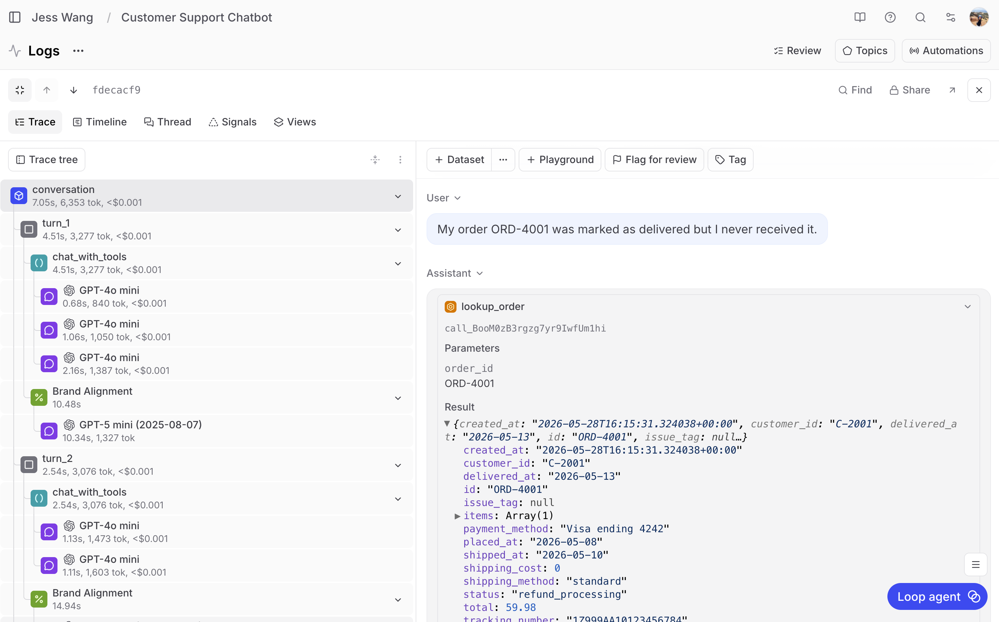
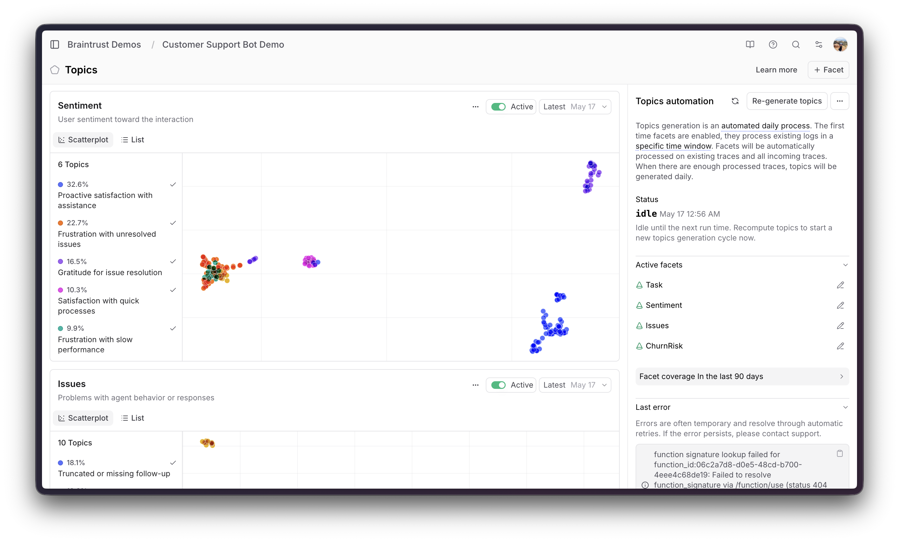
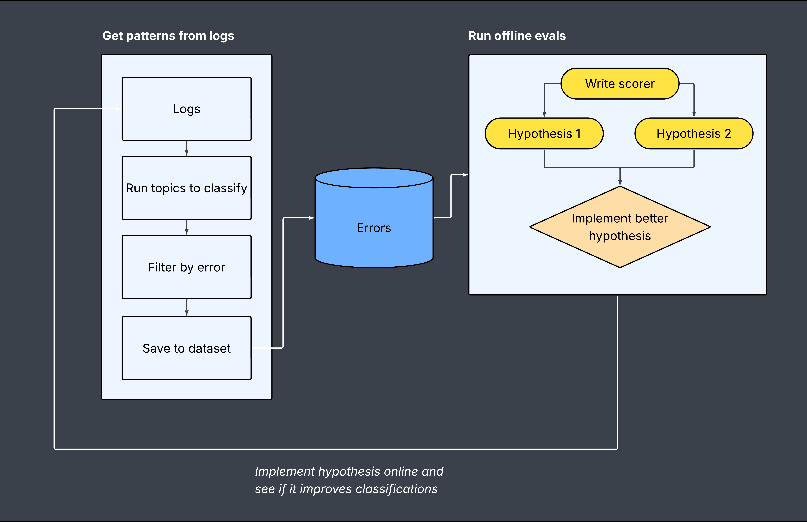

# Finding production issues using Topics

Your existing evals tell you how well your AI performs on things you already know to test for, but what about the patterns and failure modes that you're not aware of yet?

In this cookbook, we'll build a customer support chatbot that generates hundreds of conversation logs between human and AI, and use [Topics](/docs/topics/index) to surface patterns in the system that we wouldn't have caught with traditional evaluations. 

By the end, you'll learn how to:

- Use Topics to classify conversations by task, sentiment, and issues
- Dig into failure clusters to identify specific prompt and system-level bugs
- Build targeted eval datasets from Topics classifications
- Iterate on prompts and measure improvement with offline evals

## Project setup

We're building a customer support chatbot for a fictional e-commerce company called Evergreen Goods. The chatbot uses OpenAI's API to interact with Supabase to look up orders, process refunds, initiate returns, and check shipping status.

You'll need:

- A [Braintrust account](https://www.braintrust.dev/signup) with an API key
- An [OpenAI API key](https://platform.openai.com/)
- A [Supabase](https://supabase.com/) project with Edge Functions enabled
- Python 3.12+ with the `braintrust`, `openai`, and `requests` packages

Clone the cookbook and install dependencies:

```bash
git clone https://github.com/braintrustdata/braintrust-cookbook.git
cd braintrust-cookbook/examples/FindingProductionIssues/customer-support-bot
pip install -r requirements.txt
```

Set the required environment variables:

```bash
export OPENAI_API_KEY="your-openai-api-key"
export BRAINTRUST_API_KEY="your-braintrust-api-key"
export SUPABASE_SERVICE_ROLE_KEY="your-supabase-key"
```

### Setup and code explanation

The Supabase database has six tables:

- **customers** — customer profiles with loyalty tiers (Bronze, Silver, Gold) and point balances
- **products** — 15 outdoor/lifestyle products with SKUs, prices, sizes, and colors
- **orders** — orders with statuses (shipped, delivered, cancelled, etc.), tracking numbers, and payment info
- **returns** — return records linked to orders
- **refund_requests** — refund records with processor responses
- **support_tickets** — escalation tickets created by the bot

Our customer support chatbot has two types of tools:

**Read tools** query the Supabase REST API (PostgREST) directly:

```python
def lookup_order(order_id: str) -> dict | None:
    resp = requests.get(
        f"{SUPABASE_URL}/rest/v1/orders",
        headers={**_REST_HEADERS, "Accept": "application/vnd.pgrst.object+json"},
        params={"id": f"eq.{order_id}", "select": "*"},
        timeout=10,
    )
    if resp.status_code == 406 or resp.status_code == 404:
        return None
    resp.raise_for_status()
    return resp.json()
```

**Action tools** call Supabase Edge Functions on services like payment processors, shipping carriers, and label services.

```python
def _call_edge_function(function_name: str, payload: dict) -> dict:
    url = f"{SUPABASE_URL}/functions/v1/{function_name}"
    resp = requests.post(url, json=payload, timeout=15)
    return {"status_code": resp.status_code, **resp.json()}
```

The complete tool implementations are in [`supabase_tools.py`](https://github.com/braintrustdata/braintrust-cookbook/blob/main/examples/FindingProductionIssues/customer-support-bot/supabase_tools.py) and the chatbot itself is in [`chat_app.py`](https://github.com/braintrustdata/braintrust-cookbook/blob/main/examples/FindingProductionIssues/customer-support-bot/chat_app.py).

And this is our initial system prompt:

```
You are a helpful customer support agent for an e-commerce company
called Evergreen Goods.

POLICIES:
- Return window: 30 days from delivery
- Refund processing: 5-7 business days
- Exchanges: Same item, different size/color. Subject to availability.
- Damaged items: Full refund or replacement. No return shipping required.
- Shipping: Standard (free over $50), Express ($12.99-$14.99), Overnight ($24.99)

INSTRUCTIONS:
- Always use the provided tools to look up real data before answering.
- Never fabricate order numbers, tracking numbers, prices, or dates.
- If a customer provides an order number or email, look it up first.
- When a customer wants a refund, USE the process_refund tool.
- When a customer wants to return an item, USE the initiate_return tool.
- If you cannot resolve an issue, USE escalate_to_human.
- Be empathetic but efficient. Take action when you can.
```

## Generating conversation logs

The log generator runs 51 scripted scenarios across six categories, with optional generated follow-up turns:

```python
SCENARIOS = [
    # Shipping
    ("Where is my order ORD-4002? It's been 5 days and still no delivery.",
     ["Can you give me a more specific ETA?"], "shipping"),

    # Returns
    ("I need to return ORD-4007. I ordered a size S but I actually need a M.",
     ["Can I do an exchange instead of a refund?"], "returns"),

    # Billing
    ("I applied a promo code on ORD-4005 but wasn't given the discount.",
     ["The code was SUMMER20."], "billing"),

    # Account
    ("My email is sarah.chen@example.com. Can you check my loyalty points balance?",
     ["When do my Gold perks expire?"], "account"),

    # Product
    ("Does the Waterproof Shell Jacket (SKU-1004) come in size XS?",
     [], "product"),

    # Orders not in system
    ("Where is my order ORD-9901? I placed it last week.",
     ["Can you check by my email? sarah.chen@example.com"], "shipping"),
    # ... 51 total scenarios
]
```

The complete scenario list and log generation logic is in [`generate_logs.py`](https://github.com/braintrustdata/braintrust-cookbook/blob/main/examples/FindingProductionIssues/customer-support-bot/generate_logs.py).

```bash
python generate_logs.py  # Run this several times
```

Each conversation is logged to Braintrust with full tracing. That means every tool call, LLM response, and each conversational turn is logged to Braintrust.



We run the generator multiple times to build up volume, because Topics needs at least ~100 traces to start clustering effectively. Each run shuffles the scenario order and uses a temperature of 1.0, so the bot's responses vary across runs. That way, the same customer complaint might get a slightly different resolution path each time, which gives Topics more diverse data to cluster against.

## Using Topics to find failures

Once the logs are in Braintrust, navigate to **Topics** in your project. Topics automatically classifies each conversation across three built-in facets:

- **Task** — What was the customer trying to do? In this project, Topics identified clusters like "Product sizing and returns" for customers dealing with fit issues and return requests, "Shipping status inquiries" for customers tracking delayed packages, and "Billing disputes" for promo code and double-charge complaints.
- **Sentiment** — How did the customer feel about the interaction? Topics classified conversations into clusters like "Positive resolution" where the customer's issue was handled well, "Negative emotional distress" where the customer left frustrated, and "Neutral informational" for straightforward product questions.
- **Issues** — Did something go wrong during the conversation? This facet surfaced clusters like "Payment processing failures" where the refund tool returned errors, and "Order lookup errors" where the bot couldn't find an order number in the system.



## Digging into the failure cluster

Filtering to **Sentiment: Negative emotional distress** showed that a majority (32%) of negative conversations were classified under the "Product sizing and returns" task cluster. This is where customers were most frustrated.

At this point, I would recommend spending a good 20-30 minutes manually reading through the logs. Though you could technically use AI to automate this portion of it, it's better to have a human read through and decide which AI responses were fine (even if it evoked negative emotion) versus which ones fundamentally need to be fixed. As I did this myself, I wrote down what needed to be fixed in my system.

**1. Order not found = dead end.** When a customer referenced an order number that wasn't in the system, the bot just said "order not found" and stopped. I think the correct behavior should be to look up the customer's account to find valid order numbers, or find other order numbers that are close to what the customer provided, in case they made a typo.

**2. Shipping delays = no refund.** When a customer paid for express shipping and it took 8 days (well past the 2-3 day window), the bot refused to refund shipping because the order status was "shipped." I think the correct behavior here would be to allow for a full refund on shipping only.

**3. Return + refund race condition.** When processing a return and refund together, the bot would process the refund first, then tell the customer they couldn't return the item because "a refund is in progress."

**4. Promo code delays.** When a customer reported a missing promo discount, the bot correlated the return status of the product with discount eligibility. However, promo discounts are applied at checkout, so delivery status is irrelevant.

**5. 5xx errors = immediate escalation.** When a tool call hit a transient server error, the bot immediately escalated to a human instead of having any sort of retry logic setup.

## Building a targeted eval dataset

From the Topics UI, we saved the conversations in the "Product sizing and returns" cluster to a dataset called **Product Sizing and Return Issues**. This gives us a focused eval set containing exactly the conversations where the bot was failing.

We cleaned the dataset to contain just the customer messages and the turn count so that we could replay it faithfully.

**Before cleaning**:
```json
{
  "input": [
    {"role": "system", "content": "You are a helpful customer support agent..."},
    {"role": "user", "content": "I paid for express shipping on ORD-4006 and it's been 8 days."},
    {"role": "assistant", "content": "", "tool_calls": [{"function": {"name": "lookup_order"}}]},
    {"role": "tool", "content": "{\"status\": \"shipped\", ...}"},
    {"role": "assistant", "content": "I see your order is still in transit..."},
    {"role": "user", "content": "I want a refund on the shipping cost at minimum."},
    {"role": "assistant", "content": "Unfortunately I cannot process a refund..."}
  ],
  "expected": "Unfortunately I cannot process a refund...",
  "metadata": {"category": "shipping", "total_turns": 2}
}
```

**After cleaning:**
```json
{
  "input": "I paid for express shipping on ORD-4006 and it's been 8 days.\n---\nI want a refund on the shipping cost at minimum.",
  "metadata": {
    "num_customer_messages": 2,
    "num_turns": 5
  }
}
```

## Running offline evals

The eval script runs each customer complaint through the chatbot with real Supabase tools, then scores the response with three LLM-based scorers. These are separate from the online scorers you see in the Topics logs view (Brand Alignment and Conversation Quality, which Braintrust applies automatically) — the eval scorers are custom functions we wrote to measure specific dimensions:

- **Helpfulness** checks whether the agent addressed the customer's concern and provided clear next steps. 
- **Resolution** checks whether the agent actually took action — processed a refund, initiated a return, provided tracking — or just acknowledged the problem without doing anything. 
- **Empathy** checks whether the agent's tone was professional and acknowledged the customer's frustration.

```python
Eval(
    "Customer Support Chatbot",
    data=load_dataset,
    task=lambda input, expected=None, **_: run_support_conversation(
        input["customer_input"],
        num_customer_messages=input["num_customer_messages"],
    ),
    scores=[helpfulness_scorer, resolution_scorer, empathy_scorer],
    experiment_name="product-sizing-returns-v1",
)
```

The complete eval script is in [`eval_product_sizing_returns.py`](https://github.com/braintrustdata/braintrust-cookbook/blob/main/examples/FindingProductionIssues/customer-support-bot/eval_product_sizing_returns.py).

The v1 baseline scores on the Product Sizing and Return Issues dataset:

| Scorer | v1 Score |
| --- | --- |
| Helpfulness | 50% |
| Resolution | 62.5% |
| Empathy | 62.5% |

## Fixing the prompt

Based on the five failure patterns from Topics that I outlined above, we updated the system prompt:

```diff
  POLICIES:
+ - Shipping refunds: If a shipment is delayed beyond the expected
+   delivery window, process a refund for the shipping cost using
+   process_refund. A "shipped" status does NOT block shipping refunds.
+ - Promo codes: If a customer reports a missing promo discount, process
+   a refund for the discount amount. Do NOT check return eligibility or
+   tell them to wait for delivery — it's a billing correction, not a return.

  INSTRUCTIONS:
+ - If an order number is not found, try to help: look up the customer's
+   account by email to find valid orders, or ask clarifying questions.
  - When a customer wants a refund, USE the process_refund tool.
+ - Do NOT just escalate — process it yourself.
+ - If a tool call fails with a server error (5xx), retry once before
+   giving up.
+ - When you process a return and refund together, confirm both actions
+   in one response. Do not tell the customer they can't return because
+   a refund is in progress.
+ - ONLY use escalate_to_human as a LAST RESORT after all relevant
+   tools have failed.
```

We also fixed the backend: the `process-refund` edge function was updated to allow refunds on `shipped` orders (not just `delivered`). The original edge function had a status check that only permitted refunds when `order.status` was `delivered` or `return_in_progress`, so even when the prompt told the bot to process a shipping refund, the API rejected it with an `INVALID_ORDER_STATUS` error. Adding `shipped` to the allowed statuses unblocked the prompt fix.

## Measuring improvement

Running the same eval dataset with the updated prompt:

| Scorer | v1 | v2 | Change |
| --- | --- | --- | --- |
| Helpfulness | 50% | 87.5% | +37.5 |
| Resolution | 62.5% | 75% | +12.5 |
| Empathy | 62.5% | 75% | +12.5 |

Helpfulness nearly doubled. The bot is now actually processing refunds for delayed shipments, handling promo codes as billing corrections, and retrying on transient errors instead of immediately escalating.

You can compare the two experiments side-by-side in Braintrust to see exactly which conversations improved and which still need work.

## Deploying and monitoring

After validating the v2 prompt with offline evals, we updated the production system prompt and generated a fresh batch of ~200 logs. Topics reclassified the new conversations, and the failure patterns from the original clusters were significantly reduced.

This is the core loop that Topics enables:

1. **Log** production conversations with tracing
2. **Classify** automatically with Topics (task, sentiment, issues)
3. **Identify** failure clusters you didn't know existed
4. **Save** the failing conversations to a dataset
5. **Eval** prompt changes against that dataset
6. **Deploy** and verify with fresh production logs



The key insight: you don't need to anticipate every failure mode upfront. Topics finds them for you from real traffic patterns, then gives you the data to build targeted evals that prevent regressions.

## Next steps

- Add [custom facets](/docs/topics/index#custom-facets) to classify dimensions specific to your domain (e.g., "Resolution Gap" — did the bot sound helpful but fail to actually resolve the issue?)
- Set up [online scoring](/docs/evaluate/online-scoring) to get real-time quality signals alongside Topics classifications
- Explore the [Braintrust SDK](/docs/reference/sdk/python) to programmatically query Topics data and build automated alerting
