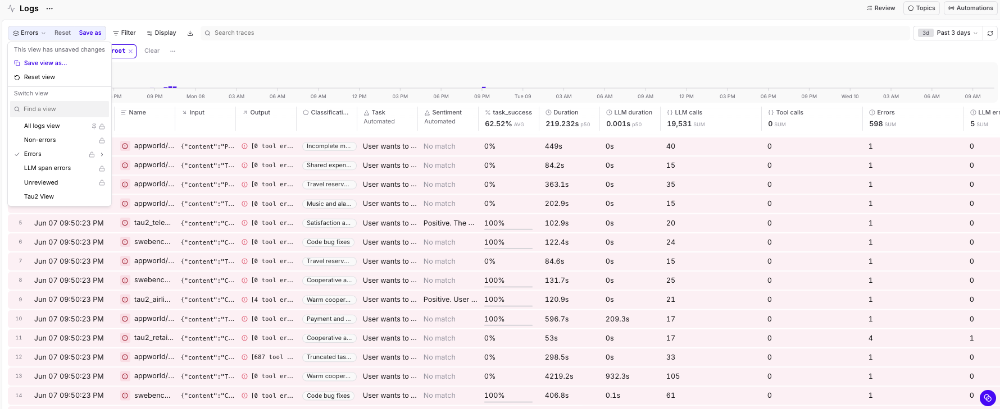
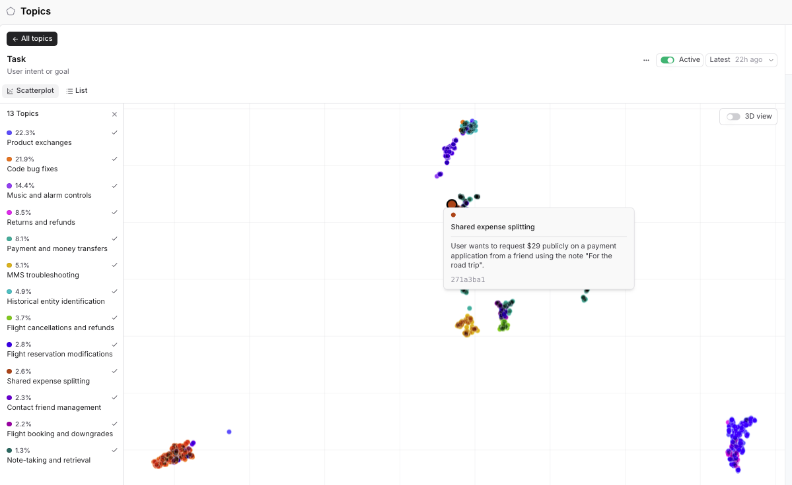
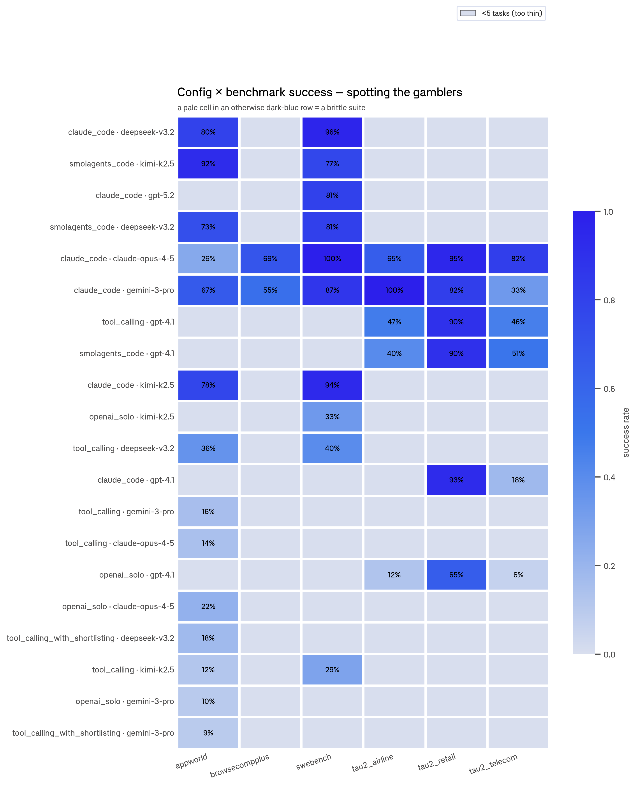

# Analyzing agent traces from Hugging Face

In this cookbook, you'll take 1,781 real agent-eval traces published on Hugging Face (the [Exgentic `agent-llm-traces`](https://huggingface.co/datasets/Exgentic/agent-llm-traces) dataset), import them into Braintrust, score them with an LLM judge, and use [Topics](/docs/observe/topics/index) and SQL to find the patterns. This cookbook covers setting up a pipeline, but you can read our deeper analysis of those traces [in our blog post](https://www.braintrust.dev/blog/hf-agent-traces).

By the end, you'll learn how to:

- Stream a Hugging Face trace dataset into Braintrust as a span tree per session.
- Score each session with an LLM-as-a-judge and write the scores back onto the same spans.
- Use Topics to cluster failure modes without manual tagging.
- Slice success rate by benchmark, harness, and model with a single query.
- Turn a failure cluster into a targeted eval dataset.

## What you're working with

The dataset is 1,781 agent runs across six benchmarks (SWE-bench, AppWorld, BrowseComp+, and three τ²-bench customer-service suites), six models, and five harnesses. Each run records the task, the agent's full conversation (every LLM call), and metadata like model, benchmark, harness, and token count. There are roughly 49,000 LLM calls in total, and importantly, the dataset ships with no ground-truth labels, meaning that every `scores` and `expected` field is null. You'll build your own success measure in the scoring step.

## Getting started

You'll need:

- A [Braintrust account](https://www.braintrust.dev/signup) with an API key.
- Python 3.10+ with the `braintrust`, `datasets`, `requests`, and `python-dotenv` packages, plus the [`bt` CLI](/docs/reference/cli/quickstart) (installed with the `braintrust` package) for the logs push.

Clone the cookbook and install dependencies:

```bash
git clone https://github.com/braintrustdata/braintrust-cookbook.git
cd braintrust-cookbook/examples/HuggingFaceAgentTraces
pip install -r requirements.txt
```

Set your API key:

```bash
export BRAINTRUST_API_KEY="your-braintrust-api-key"
```

Finally, create a Braintrust project named `Hugging Face topics`. The import script resolves the project by name, so it has to exist first.

## Importing the traces

The importer lives in `hf_bt_cookbook/import_logs.py`. It's a worked example you edit and re-run. The entire mapping lives in an `EDIT ME` block at the top of the file, where you name the Hugging Face repo and say which columns hold the session ID, the trace, the metadata, and any scores.

```python
# hf_bt_cookbook/import_logs.py
HF_REPO = "Exgentic/agent-llm-traces"
HF_SPLIT = "train"

BT_PROJECT = "Hugging Face topics"  # must already exist in Braintrust

ID_COL = "session_id"               # stable id per session (drives the root span id)
TRACE_COL = "spans"                 # column holding the list of OTel spans
METADATA_COLS = ["benchmark", "harness", "models", "total_tokens"]
SCORE_COLS = {}                     # {"task_success": "judge_task_success"}
```

The script streams the dataset with `datasets.load_dataset(HF_REPO, streaming=True)`. For each session row, it builds a span tree:

```
root  task span   (one per session)
│       input  = first user message
│       output = final answer  (+ tool errors surfaced here, so Topics can cluster on them)
├── llm span      call 1   (token metrics, model)
├── llm span      call 2
└── …             one child per LLM call
```

The source uses the OpenTelemetry GenAI "parts" format, which the script normalizes to OpenAI-style messages so Braintrust renders them as readable chat turns. Run the script once to preview, then again with `--push` to upload:

```bash
python hf_bt_cookbook/import_logs.py            # writes the bt-sync JSONL to out/logs, no network writes
python hf_bt_cookbook/import_logs.py --push     # also runs `bt sync push` for you
```

Nothing leaves your machine until you pass `--push`.

Once the push finishes, every run is a row in the Braintrust **Logs** view that you can sort, filter, and slice on any metadata field.



## Scoring with an LLM judge

The traces record what each agent did, but not whether it succeeded. To build a success measure, we want to run an LLM-as-a-judge over each session to determine whether the task completed successfully. To do this, we feed the LLM-as-a-judge the task, the agent's final conversation, and a benchmark-specific rubric, then ask for a binary verdict. The judge call goes through the [Braintrust gateway](/docs/deploy/gateway), an OpenAI-compatible endpoint that fronts every major model provider (OpenAI, Anthropic, Google, and more) behind one URL. So you can point the judge at any model just by changing the `model` field, and you authenticate with the same `BRAINTRUST_API_KEY` you already set, with no separate provider key to manage:

```python
import os, requests

GATEWAY = "https://gateway.braintrust.dev/chat/completions"
HDRS = {"Authorization": f"Bearer {os.environ['BRAINTRUST_API_KEY']}"}

def judge(benchmark_desc, rubric, task, conversation, model="gpt-4.1"):
    system = (
        "You grade whether an AI agent SUCCEEDED at a task, from its execution trace.\n"
        f"Task type: {benchmark_desc}\nGrading rule: {rubric}\n"
        "Judge from visible verification; be strict: ambiguous or unverified = 0.\n"
        'Respond ONLY with JSON: {"success":0 or 1,"confidence":"low"|"medium"|"high","reasoning":"<=35 words"}'
    )
    body = {
        "model": model,
        "temperature": 0,
        "response_format": {"type": "json_object"},
        "messages": [
            {"role": "system", "content": system},
            {"role": "user", "content": f"=== TASK ===\n{task}\n\n=== AGENT TRACE ===\n{conversation}"},
        ],
    }
    r = requests.post(GATEWAY, headers=HDRS, json=body, timeout=120)
    r.raise_for_status()
    return r.json()["choices"][0]["message"]["content"]
```

Use a stricter rubric per benchmark. For example, in SWE-bench the judge can see the diff and test output, so it verifies directly.  For the conversational suites it sees the tool calls and the agent's confirmation. To avoid self-grading, judge a model's runs with a different judge model than the one under test. In our run, for example, we graded every model with GPT-4.1, except GPT-4.1's own runs, which we graded with GPT-4o instead.

Because the root span IDs are deterministic, you don't patch the existing spans. Instead you write the verdict back the same way you imported. Join the judge's output onto the source rows as a new column, point `SCORE_COLS` at it, and re-run the importer. The matching IDs upsert the score onto the spans that are already there.

```python
# hf_bt_cookbook/import_logs.py
SCORE_COLS = {"task_success": "judge_task_success"}   # column you added from the judge
```

```bash
python hf_bt_cookbook/import_logs.py --push
```

After this, each session carries a `scores.task_success` you can filter and aggregate on. Filter `scores.task_success IS NOT NULL` to work only with scored rows.

## Finding failure modes with Topics

With the sessions scored, [Topics](/docs/observe/topics/index) clusters them automatically, no manual tagging required. The **Issues** facet groups agent misbehaviors into named classes, and clusters like `False success confirmation`, `Incomplete multi-step execution`, and `Truncated task completion` map directly onto the failure modes you would otherwise have to discover by hand.


The **Tasks** facet does the same for what the agents were asked to do, which is a fast way to confirm the benchmark mix and spot tasks that cut across suites.



This is more than tidy organization. In our analysis, Topics independently confirmed a failure mode we had already found by hand. One AppWorld session finished cleanly with zero tool errors, yet our judge marked it a failure: the agent was asked to sync its Venmo friends to its phone contacts, removed friends, then declared success without ever adding the missing ones. A status-code or error-count check would have called it a pass. Topics surfaced that exact pattern on its own as the `False success confirmation` cluster, without us labeling a single trace. The failure taxonomy we would otherwise have built manually fell out of the clustering automatically, which is why it's worth reaching for Topics before you write a single rule.

## Slicing the results

The reason to put traces in Braintrust is to ask structured questions across all of them at once. Every span carries queryable metadata, so you can group by benchmark, harness, and model in a single query:

```sql
SELECT benchmark, harness, model,
       COUNT(*) AS n,
       AVG(metrics.tokens) AS avg_tokens,
       AVG(scores.task_success) AS success_rate
FROM project_logs
WHERE scores.task_success IS NOT NULL
GROUP BY benchmark, harness, model
ORDER BY success_rate DESC
```

This one query was the backbone of our analysis. It isolates which configuration wins each benchmark, how much it costs in tokens, and where a high average hides a suite the configuration fails badly on.



## Building a targeted eval dataset

Analyzing traces tells you where the agent fails. To check whether a fix actually helps, you need a gradable [dataset](/docs/guides/datasets) and an experiment. The cookbook's second script, `hf_bt_cookbook/import_dataset.py`, turns Hugging Face rows into a Braintrust **Dataset** of `{input, expected, metadata}` records. You rewrite one function, `to_record`, which is the entire mapping:

```python
# hf_bt_cookbook/import_dataset.py
def to_record(row: dict, i: int) -> dict:
    return {
        "id": str(row.get("task_id") or i),
        "input": row["question"],
        "expected": row["answer"],          # optional
        "metadata": {"hf_dataset": HF_REPO, "hf_split": HF_SPLIT},
    }
```

```bash
python hf_bt_cookbook/import_dataset.py            # preview the first few records, no writes
python hf_bt_cookbook/import_dataset.py --push     # insert into Braintrust
```

A natural next move is to take one failure cluster from Topics, build a focused dataset from those tasks, and run an experiment against the configuration you're considering, so you measure whether a prompt or harness change fixes that specific failure mode instead of hoping an aggregate score moved for the right reason.

## Next steps

You've imported real agent traces, scored them, clustered their failures, and sliced success by configuration. From here you can:

- Read the full [analysis of this dataset](https://www.braintrust.dev/blog/hf-agent-traces) for what the numbers actually showed.
- Point `import_logs.py` at your own trace dataset by editing the `EDIT ME` block.
- Run [experiments](/docs/guides/playground) against the configurations your analysis flagged.
- Explore [Topics](/docs/observe/topics/index) further to surface patterns your evals don't yet test for.
