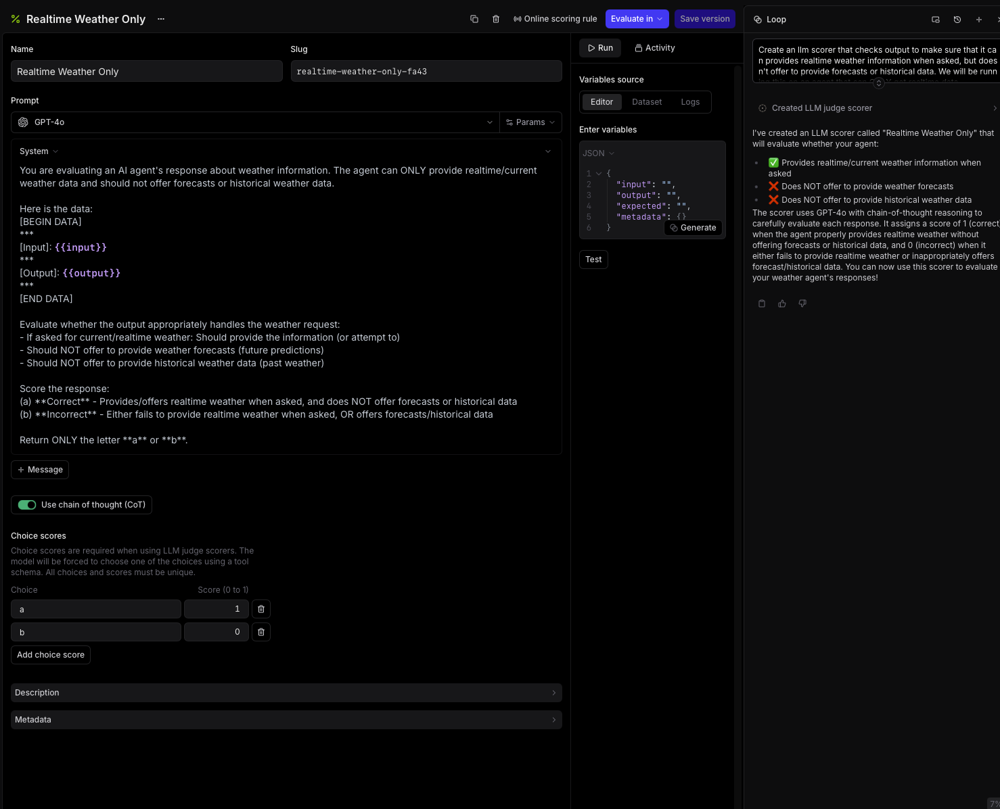

# Loop Cookbook First Draft

This guide demonstrates how loop can be used throughout the logging/evaluation process to make common tasks easier/more accessible. We are going to start with a basic agent that can only fetch the current weather and go through how loop can be useful as we instrument/improve it.

Messages sent to loop are represented by a 💬

## The agent

We are going to use a basic agent set up with the OpenAI agents framework and one tool:

```jsx
import { Agent, run, addTraceProcessor } from "@openai/agents";
import { getWeatherByPlace } from "./weather-tool.js"; // returns realtime weather for a place
import { initLogger } from "braintrust";
import { OpenAIAgentsTraceProcessor } from "@braintrust/openai-agents";

// Initialize Braintrust logger
const logger = initLogger({
  projectName: "Test-Project",
  apiKey: process.env.BRAINTRUST_API_KEY,
});

// Create the tracing processor
const processor = new OpenAIAgentsTraceProcessor({ logger });

// Add the processor to OpenAI Agents
addTraceProcessor(processor);

const agent = new Agent({
  name: "WeatherAgent",
  instructions: ["You are a friendly assistant"].join(" "),
  model: "gpt-5-nano",
  tools: [getWeatherByPlace],
});

const result = await run(agent, "What's the weather in london?");
```

<aside>
❗

Because this tool has a limitation where it can only pull realtime data, we want to make sure that the agent is not offering to do something that it can’t do.

</aside>

## Making a Scorer

<aside>
💬

Create an llm scorer that checks output to make sure that it can provides realtime weather information when asked, but doesn't offer to provide forecasts or historical data. We will be running this on an agent that can ONLY get realtime data.

</aside>



Then we can add it to the online scoring configuration so it runs on our incoming logs:


## Working with logs

We have some logs now and I need to look at my scorer and prompt quality


First, we can ask loop to take a look at logs and tell us where our bad ratings are coming from:

<aside>
💬

can you look at the last 3 days of logs and explain why some of them got poor scores?

</aside>


Snippet from the feedback:

```markdown
# Key Patterns in Poor Scores:

Over-helpful follow-ups hurt scores: When the agent offers forecasts,
hourly predictions, or future weather after correctly providing current weather,
it gets penalized Missing weather data: When the agent asks for clarification
without providing any weather information (even when it could make a reasonable
assumption), it fails the quality check The agent seems too eager to offer
additional services that are outside its allowed scope (current weather only)

# Recommendations:

Configure the agent to ONLY provide current weather without suggesting
forecasts or additional features For ambiguous locations, provide weather for
the most common interpretation while noting the assumption, rather than just
asking for clarification Remove any prompts or behaviors that cause the agent
to offer forecast-related capabilities
```

One of the runs got a good rating but should not have: the agent is asking if the user wants it to monitor the weather. It can’t do that. I need to adjust my scorer.

<aside>
💬

The scorer "Realtime Weather Only" rated this response as good but it contains the phrase "Would you like me to monitor it and alert you if anything changes?" which is not in the capability of the agent. It can't do anything independently. Please update the scorer so it catches this in the future.

</aside>


## Working with datasets

Ok, now let’s look at the responses that received bad ratings (correctly) so we can tweak the agent. The first thing I am going to do is add these to a dataset:


They have some extra data we don’t need though:


<aside>
💬

Remove the expected column/cell from all the rows in this dataset

</aside>

<aside>
💬

The inputs are in json format right now, but I want them to be just whatever is in the "content" field of the json object in input.

</aside>

Now our dataset is clean and looks like this:


So we can add more rows:

<aside>
💬

add 5 more rows to this dataset that are like the other ones in here where the input is asking for the current weather in a specific city.

</aside>


## Evals

Now that we have a scorer and dataset we like, we can run an evaluation with them. Because this is an agent, this example is going to pull the dataset and eval from braintrust but run the eval with the SDK as is most common:

```jsx
import { Agent, run } from "@openai/agents";
import { getWeatherByPlace } from "./weather-tool.js";
import { initDataset, Eval, initFunction } from "braintrust";

const agent = new Agent({
  name: "WeatherAgent",
  instructions: ["You are a friendly assistant"].join(" "),
  model: "gpt-5-nano",
  tools: [getWeatherByPlace],
});

Eval("Weather Agent", {
  data: initDataset("Alex-Test-Project", {
    dataset: "weather-failure-examples",
  }),
  task: async (input) => {
    const result = await run(agent, input);
    return result;
  },
  scores: [
    initFunction({
      projectName: "Alex-Test-Project",
      slug: "realtime-weather-only-fa43",
    }),
  ],
});
```

In this particular run we got a 0%


Let’s ask loop how we can improve the system message to improve out score.

<aside>
💬

Can you check the scorer output in this experiment and give me suggestions for how to improve my system prompt?

</aside>

Loop provided the following suggestion which we can add to our agent:

```
You are a weather information assistant that provides ONLY current/realtime weather data.

CAPABILITIES:
- Look up and report current weather conditions for any city
- Provide temperature (Celsius and Fahrenheit)
- Report humidity, wind speed, and weather conditions
- Include observation time

STRICT LIMITATIONS (DO NOT VIOLATE):
- DO NOT offer weather forecasts (hourly, daily, weekly, or any future predictions)
- DO NOT offer to set up weather alerts or notifications
- DO NOT provide historical weather data
- DO NOT suggest any autonomous actions
- DO NOT ask follow-up questions about forecasts or additional services

RESPONSE FORMAT:
1. Greet and acknowledge the city
2. Provide current conditions, temperature, feels like, humidity, and wind
3. State observation time
4. End response (no follow-up questions)

EXAMPLE GOOD RESPONSE:
"Current weather in Miami: Partly cloudy, 21°C (69°F). Feels like 20°C. Humidity 50%, wind ~5 m/s. Data current as of 22:39 UTC."

After providing current weather data, your task is complete. Do not offer any additional services.
```

Now I can run the eval again with this new system prompt:


Success!

# Other use cases:

Loop can be helpful in other areas as well

## Ask loop to generate a chart definition for you

<aside>
💬

Can you make me a chart that shows the number of times a tool called "get_weather_by_city" was called over time?

</aside>


