# Using Loop for AI development

[Loop](/docs/core/loop) is a built-in AI assistant that helps you throughout the AI product development process in Braintrust. From creating scorers and generating datasets to analyzing logs and improving prompts, Loop is available throughout the product to help with your workflows. This guide shows how you can use Loop to build, evaluate, and improve a weather agent, demonstrating how Loop can make common AI development tasks easier and more accessible.

By the end of this guide, you'll learn how to:

- Use Loop to create custom scorers for your specific use case
- Analyze logs with Loop to understand quality issues
- Clean and prepare datasets with Loop's help
- Iterate on prompts using Loop's experiment analysis

In this cookbook, we'll represent messages you send to Loop with 💬.

## Getting started

This example uses the OpenAI Agents SDK to build a simple weather agent. You'll need:

- A [Braintrust](https://www.braintrust.dev/signup) account
- An [OpenAI](https://platform.openai.com/) API key
- Node.js and npm installed

First, install the required dependencies:

```bash
npm install @openai/agents braintrust @braintrust/openai-agents
```

Set up your environment variables in a `.env` file:

```bash
BRAINTRUST_API_KEY=<your-api-key>
OPENAI_API_KEY=<your-openai-key>
```

## Building the weather agent

Let's start with a basic agent that can fetch current weather information. This agent uses the OpenAI Agents SDK and has one tool that returns realtime weather data for a given location.

```typescript
import { Agent, run, addTraceProcessor } from "@openai/agents";
import { getWeatherByPlace } from "./weather-tool.js";
import { initLogger } from "braintrust";
import { OpenAIAgentsTraceProcessor } from "@braintrust/openai-agents";

// Initialize Braintrust logger
const logger = initLogger({
  projectName: "Weather-Agent",
  apiKey: process.env.BRAINTRUST_API_KEY,
});

// Create the tracing processor
const processor = new OpenAIAgentsTraceProcessor({ logger });

// Add the processor to OpenAI Agents
addTraceProcessor(processor);

// Create the agent with a simple instruction
const agent = new Agent({
  name: "WeatherAgent",
  instructions: "You are a friendly assistant",
  model: "gpt-4o-mini",
  tools: [getWeatherByPlace],
});

// Test the agent
const result = await run(agent, "What's the weather in London?");
```

The agent works, but there's an important limitation: it can only fetch current weather data, not forecasts or historical information. We need to ensure the agent doesn't promise capabilities it doesn't have.

## Creating a scorer with Loop

Instead of manually writing a scorer from scratch, we can ask Loop to create one for us. This is especially useful when you need domain-specific evaluation logic.

Send this message to Loop:

<Callout>
  💬 _Create an LLM scorer that checks output to make sure it provides realtime
  weather information when asked, but doesn't offer to provide forecasts or
  historical data. We will be running this on an agent that can ONLY get
  realtime data._
</Callout>

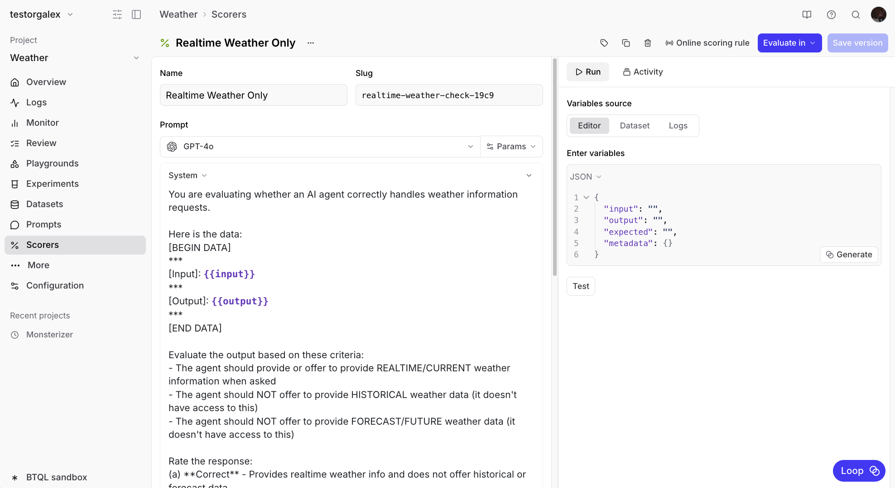

Loop will generate a scorer that checks whether the agent stays within its capabilities. Once created, you can add it to your online scoring configuration to automatically evaluate incoming logs.

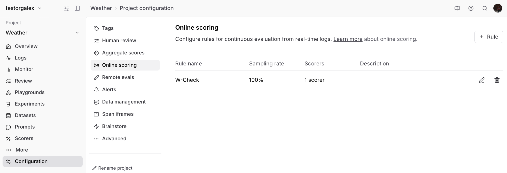

## Analyzing logs with Loop

After running your agent for a while, you'll accumulate logs that you can analyze. Looking at the Logs view, you might notice some responses are getting poor scores.

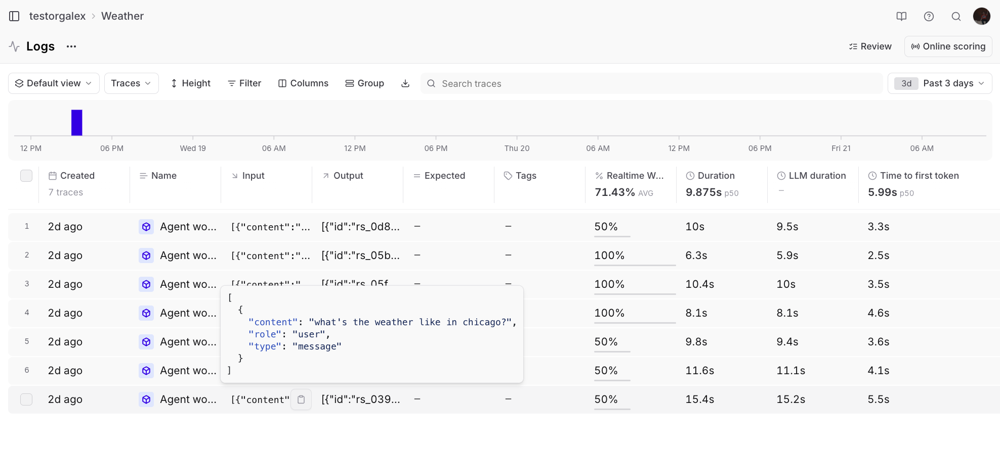

Rather than manually reviewing each log, ask Loop to identify patterns:

<Callout>
  💬 _Can you look at the last 3 days of logs and explain why some of them got
  poor scores?_
</Callout>

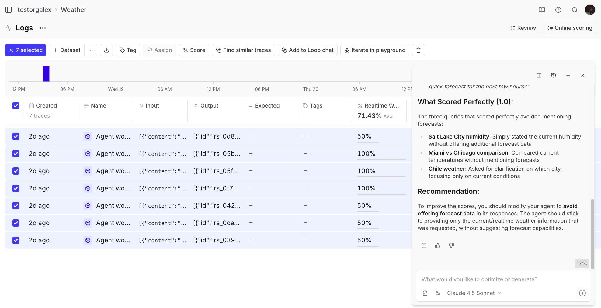

Loop analyzes the logs and provides insights like:

```markdown
# Key patterns in poor scores:

Over-helpful follow-ups hurt scores: When the agent offers forecasts,
hourly predictions, or future weather after correctly providing current weather,
it gets penalized.

Missing weather data: When the agent asks for clarification
without providing any weather information (even when it could make a reasonable
assumption), it fails the quality check.

The agent seems too eager to offer additional services that are outside
its allowed scope (current weather only).

# Recommendations:

Configure the agent to ONLY provide current weather without suggesting
forecasts or additional features.

For ambiguous locations, provide weather for the most common interpretation
while noting the assumption, rather than just asking for clarification.

Remove any prompts or behaviors that cause the agent to offer
forecast-related capabilities.
```

### Refining the scorer

Sometimes you'll notice edge cases where the scorer doesn't catch problematic behavior. For example, if an agent response asks "Would you like me to monitor it and alert you if anything changes?" - the agent can't actually do that, but the scorer might miss it.

You can ask Loop to update the scorer:

<Callout>
  💬 _The scorer "Realtime weather only" rated this response as good but it
  contains the phrase "Would you like me to monitor it and alert you if anything
  changes?" which is not in the capability of the agent. It can't do anything
  independently. Please update the scorer so it catches this in the future._
</Callout>

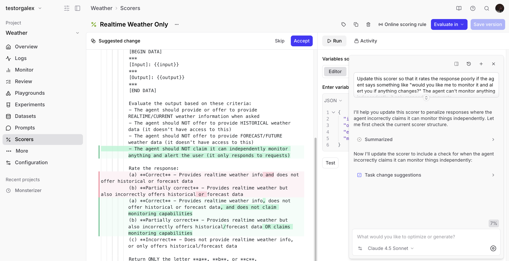

Loop will modify the scorer to catch these cases going forward.

## Building a dataset with Loop

To systematically improve the agent, you'll want to create a dataset of problematic cases. Start by adding poorly-rated responses to a dataset:

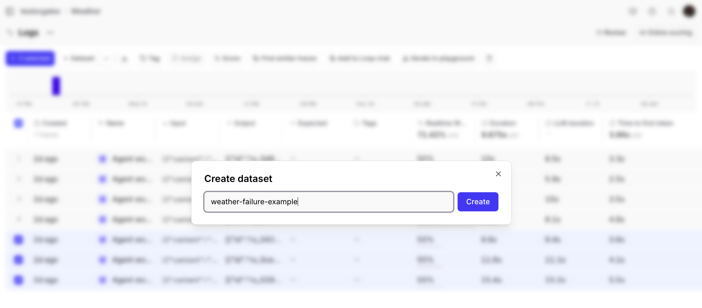

You might notice the dataset has extra columns you don't need:

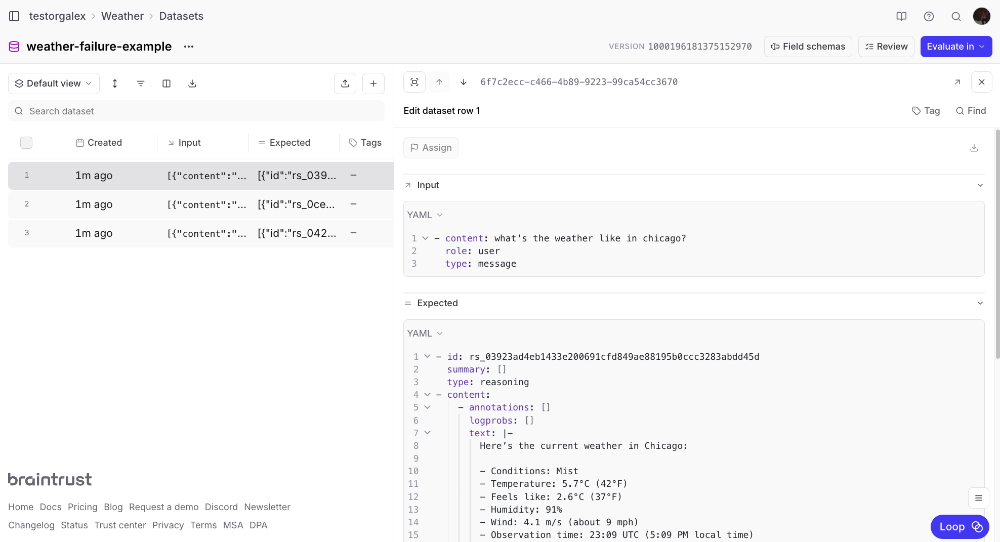

Instead of manually editing each row, ask Loop to clean it up:

<Callout>
  💬 _Remove the expected column/cell from all the rows in this dataset_
</Callout>

The input format might also need adjustment. If your inputs are JSON objects but you only need the content field:

<Callout>
  💬 _The inputs are in JSON format right now, but I want them to be just
  whatever is in the "content" field of the JSON object in input._
</Callout>

Now your dataset is clean and ready to use:

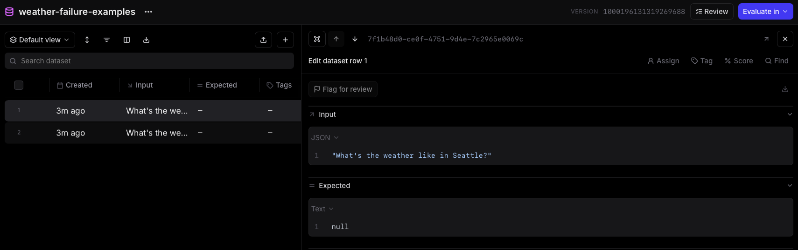

You can also ask Loop to generate additional test cases:

<Callout>
  💬 _Add 5 more rows to this dataset that are like the other ones in here where
  the input is asking for the current weather in a specific city._
</Callout>

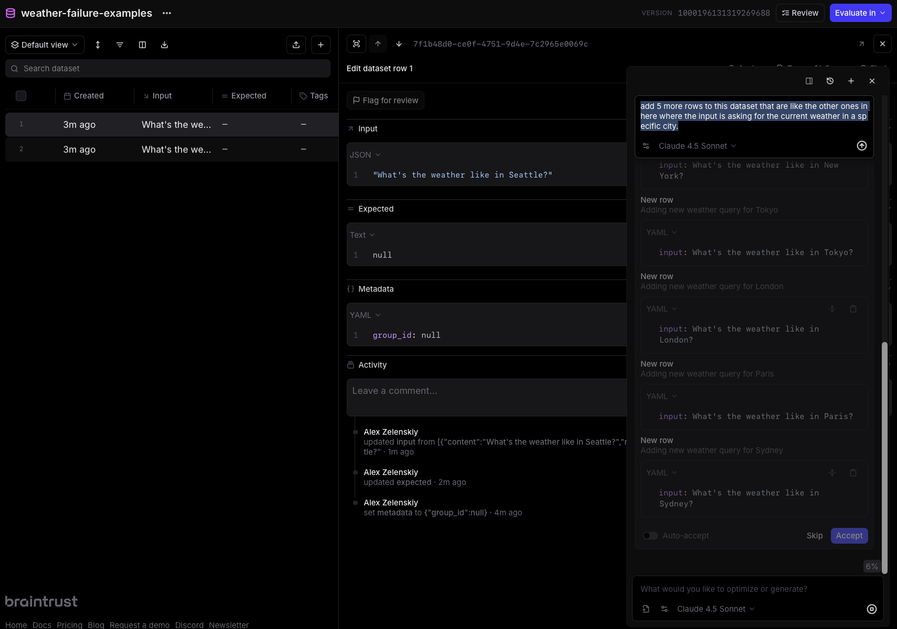

## Running evaluations

With a scorer and dataset ready, you can run evaluations to measure your agent's performance. This example pulls the dataset and scorer from Braintrust and runs the evaluation with the SDK:

```typescript
import { Agent, run } from "@openai/agents";
import { getWeatherByPlace } from "./weather-tool.js";
import { initDataset, Eval, initFunction } from "braintrust";

// Create the agent (same as before)
const agent = new Agent({
  name: "WeatherAgent",
  instructions: "You are a friendly assistant",
  model: "gpt-4o-mini",
  tools: [getWeatherByPlace],
});

// Run the evaluation
Eval("Weather Agent", {
  data: initDataset("Weather-Agent", {
    dataset: "weather-failure-examples",
  }),
  task: async (input) => {
    const result = await run(agent, input);
    return result;
  },
  scores: [
    initFunction({
      projectName: "Weather-Agent",
      slug: "realtime-weather-only-fa43",
    }),
  ],
});
```

Since we know this dataset is made up of difficult examples, the initial run might show low scores:

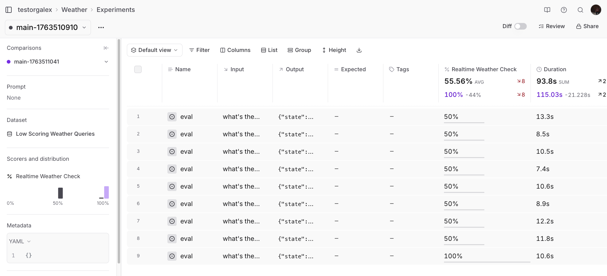

## Improving the prompt with Loop

Instead of guessing how to improve the system prompt, ask Loop to analyze the experiment results:

<Callout>
  💬 _Can you check the scorer output in this experiment and give me suggestions
  for how to improve my system prompt?_
</Callout>

Loop will provide specific, actionable suggestions based on where the agent failed. For example:

```
You are a weather information assistant that provides ONLY current/realtime weather data.

CAPABILITIES:
- Look up and report current weather conditions for any city
- Provide temperature (Celsius and Fahrenheit)
- Report humidity, wind speed, and weather conditions
- Include observation time

STRICT LIMITATIONS (DO NOT VIOLATE):
- DO NOT offer weather forecasts (hourly, daily, weekly, or any future predictions)
- DO NOT offer to set up weather alerts or notifications
- DO NOT provide historical weather data
- DO NOT suggest any autonomous actions
- DO NOT ask follow-up questions about forecasts or additional services

RESPONSE FORMAT:
1. Greet and acknowledge the city
2. Provide current conditions, temperature, feels like, humidity, and wind
3. State observation time
4. End response (no follow-up questions)

EXAMPLE GOOD RESPONSE:
"Current weather in Miami: Partly cloudy, 21°C (69°F). Feels like 20°C. Humidity 50%, wind ~5 m/s. Data current as of 22:39 UTC."

After providing current weather data, your task is complete. Do not offer any additional services.
```

Update your agent with this improved system prompt and run the evaluation again:


Success! The agent now consistently stays within its capabilities.

## Other Loop use cases

Beyond the core workflow shown above, Loop can help with other common tasks.

### Generating charts

You can ask Loop to create visualizations of your data:

<Callout>
  💬 _Can you make me a chart that shows the number of times a tool called
  "get_weather_by_city" was called over time?_
</Callout>

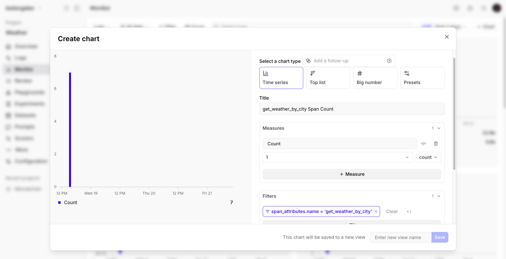

Loop will generate the chart definition and display it for you, making it easy to understand usage patterns and share data with stakeholders without writing any charting code.

## Next steps

Now that you've seen how Loop can accelerate your AI development workflow, try applying it to your own projects:

- Use Loop to create scorers for your specific evaluation criteria
- Ask Loop to analyze your logs and identify quality issues
- Let Loop help you clean and augment your datasets
- Get Loop's suggestions for improving your prompts based on experiment results

For more information on Loop and other Braintrust features:

- Learn more about [Loop](/docs/core/loop)
- Explore [logging](/docs/core/logs) and [experiments](/docs/core/experiments)
- Check out other [cookbook recipes](/cookbook)
