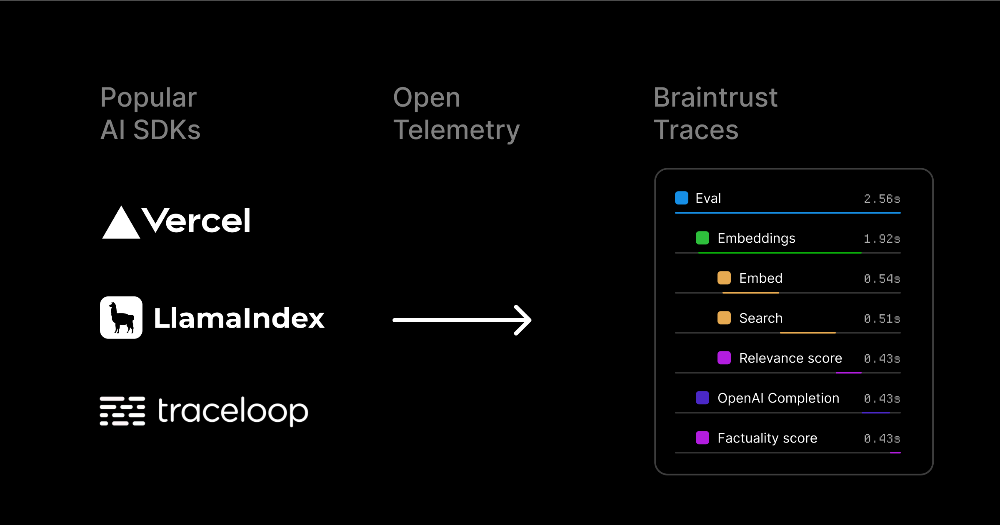
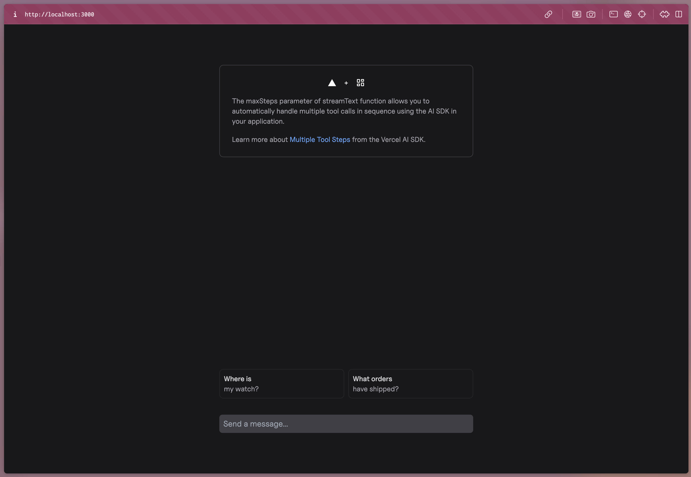

# Using OpenTelemetry for LLM observability

[OpenTelemetry](https://opentelemetry.io/docs/) (OTel) is an open-source observability framework designed to help developers collect, process, and export telemetry data from their applications for performance monitoring and debugging. It’s used by popular libraries like the [Vercel AI SDK](https://sdk.vercel.ai/), [LlamaIndex](https://docs.llamaindex.ai/en/stable/module_guides/observability/), and [Traceloop OpenLLMetry](https://www.traceloop.com/docs) for observability in AI applications. OTel support extends to many programming languages including Python, TypeScript, Java, and Go. 



In Braintrust, we enable observability in AI applications through [**logging**](/docs/guides/logging). Logs are the recorded data and metadata from an AI routine — we record the inputs and outputs of your LLM calls to help you understand and debug your application. We want to make it simple for you to log to Braintrust from many different environments, so we defined a way to set up Braintrust as an OpenTelemetry backend. This guide will walk you through how to log to Braintrust from a sample project built with the Vercel AI SDK.

## Getting started

We’ll use the [Automatic Multiple Tool Steps Preview](https://github.com/vercel-labs/ai-sdk-preview-roundtrips) sample app from Vercel to demonstrate how simple it is to log to Braintrust, even if you have multiple steps and tool calls in your application. 

To get started, you’ll need Braintrust and OpenAI accounts, along with their corresponding API keys, and the [npm](https://docs.npmjs.com/cli/init) and [create-next-app](https://github.com/vercel/next.js/tree/canary/packages/create-next-app) libraries installed locally. 

First, bootstrap the example:
```bash
npx create-next-app --example https://github.com/vercel-labs/ai-sdk-preview-roundtrips ai-sdk-preview-roundtrips-example
```

Then, we’ll need to create a `.env` file to set the required environment variables. Start by adding your OpenAI API key:
```
OPENAI_API_KEY=<your-api-key>
```

<Callout type="info">
You can also use the OpenAI API by adding your Braintrust API key and using the Braintrust [AI Proxy](/docs/guides/proxy).
</Callout>

## Setting up OTel

To set up Braintrust as an [**OpenTelemetry**](https://opentelemetry.io/docs/) backend, you'll need to route the traces to Braintrust's OpenTelemetry endpoint, set your API key, and specify a parent project or experiment. We’ll start by adding a couple more environment variables to your `.env` file:

```
OTEL_EXPORTER_OTLP_ENDPOINT=https://api.braintrust.dev/otel
OTEL_EXPORTER_OTLP_HEADERS="Authorization=Bearer <Your API Key>, x-bt-parent=project_name:<Your Project Name>"
```

Replace `<Your API Key>` with your Braintrust API key, and `<Your Project Name>` with the name of the project in Braintrust where you’d like to store your logs. 

<Callout type="info">
The `x-bt-parent` header sets the trace's parent project or experiment. You can use a prefix like `project_id:`, `project_name:`, or `experiment_id:` here, or pass in a [**span slug**](/docs/guides/tracing#distributed-tracing) (`span.export()`) to nest the trace under a span within the parent object.
</Callout>

You’ll also need to set up an [**OpenTelemetry Protocol Exporter**](https://opentelemetry.io/docs/languages/js/exporters/) (OTLP) to send traces to Braintrust. Create a new file called `instrumentation.ts` to register OTel:

```tsx
import { registerOTel } from "@vercel/otel";

export function register() {
  registerOTel({
    serviceName: "multi-step-tool-calls-demo",
  });
}
```

Then, configure Next.js telemetry by adding the following to your `next.config.mjs` file:
```
nextConfig.experimental = {
  instrumentationHook: true,
};
```

You can then use the `experimental_telemetry` option to enable telemetry on supported AI SDK function calls. In your `route.ts` file, add this import statement:

```tsx
import { getOrders, getTrackingInformation } from "@/components/data";
```

and add the `experimental_telemetry` parameter to your LLM call: 

```tsx
export async function POST(request: Request) {
  const { messages } = await request.json();

  const stream = await streamText({
    model: openai("gpt-4o"),
    system: `\
      - you are a friendly package tracking assistant
      - your responses are concise
      - you do not ever use lists, tables, or bullet points; instead, you provide a single response
    `,
    messages: convertToCoreMessages(messages),
    maxSteps: 5,
    tools: {
      listOrders: {
        description: "list all orders",
        parameters: z.object({}),
        execute: async function ({}) {
          const orders = getOrders();
          return orders;
        },
      },
      viewTrackingInformation: {
        description: "view tracking information for a specific order",
        parameters: z.object({
          orderId: z.string(),
        }),
        execute: async function ({ orderId }) {
          const trackingInformation = getTrackingInformation({ orderId });
          await new Promise((resolve) => setTimeout(resolve, 500));
          return trackingInformation;
        },
      },
    },
    experimental_telemetry: {
      isEnabled: true,
      functionId: "multi-step-tool-calls-demo",
      metadata: { foo: "bar" },
    },

  });

  return stream.toDataStreamResponse();
}
```

## Logging LLM requests in Braintrust

Run `npm install` to install the required dependencies, then `npm run dev` to launch the development server. Your app should be served on [`localhost:3000`](http://localhost:3000) or another available port.



Open your Braintrust project to the **Logs** page, and select **What orders have shipped?** in your applications. You should be able to watch the logs filter in as your application makes HTTP requests and LLM calls. 


Because this application is using multi-step streaming and tool calls, the logs are especially interesting. In Braintrust, logs consist of [traces](/docs/guides/tracing), which roughly correspond to a single request or interaction in your application. Traces consist of one or more spans, each of which corresponds to a unit of work in your application. In this example, each step and tool call is logged inside of its own span. This level of granularity makes it easier to debug issues, track user behavior, and collect data into datasets. 

### Filtering your logs

Run a couple more queries in the app and notice the logs that are generated. Our app is logging both `GET` and `POST` requests, but we’re most interested in the `POST` requests since they contain our LLM calls. We can apply a filter using the [BTQL](/docs/reference/btql) query `Name LIKE 'POST%'` so that we only see the traces we care about:

<video src="assets/add-post-filter.mp4" autoplay loop muted controls></video>

You should now have a list of traces for all the `POST` requests your app has made. Each contains the inputs and outputs of each LLM call in a span called `ai.streamText`. If you go further into the trace, you’ll also notice a span for each tool call. 

<video src="assets/spans.mp4" autoplay loop muted controls></video>

This is valuable data that can be used to evaluate the quality of accuracy of your application in Braintrust. 

## Next steps

Now that you’re able to log your application in Braintrust, you can explore other workflows like:

- Adding your [tools](/docs/guides/functions/tools) to your library and using them in [experiments](/docs/guides/evals) and the [playground](/docs/guides/playground)
- Creating [custom scorers](/docs/guides/functions/scorers) to assess the quality of your LLM calls
- Adding your logs to a [dataset](/docs/guides/datasets) and running evaluations comparing models and prompts