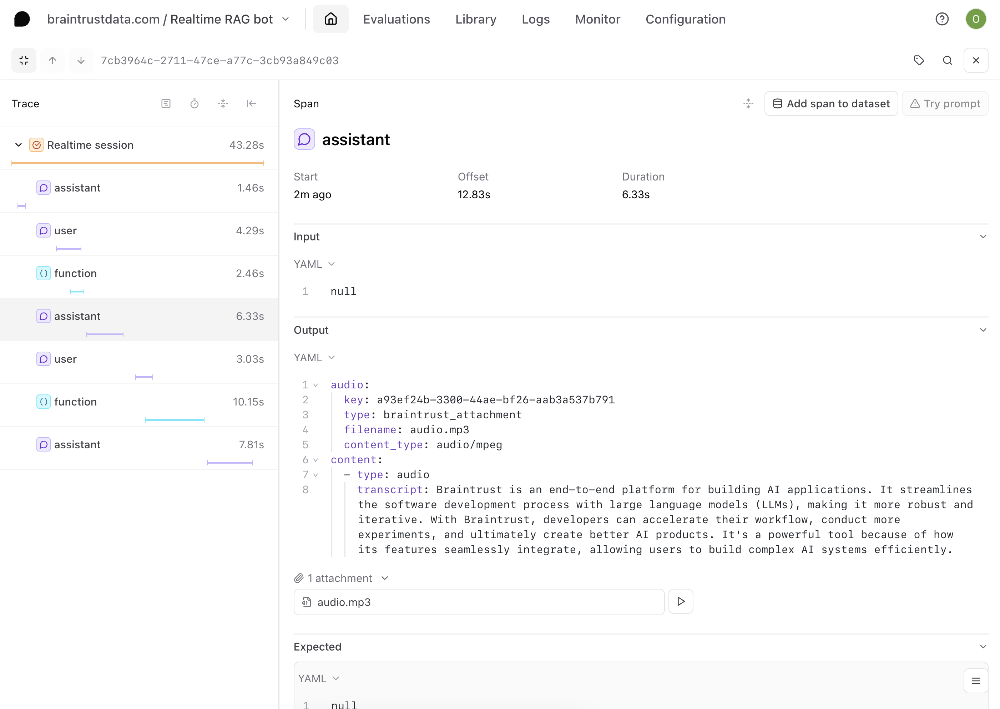

# Evaluating a speech-to-speech RAG agent built with the OpenAI Realtime API

The OpenAI [Realtime API](https://platform.openai.com/docs/guides/realtime), designed for building advanced multimodal conversational experiences, unlocks even more use cases in AI applications. However, evaluating this and other audio models' outputs in practice is an unsolved problem. In this cookbook, we'll build a robust application with the Realtime API, incorporating tool-calling and user input. Then, we'll evaluate the results. Let's get started!

## Getting started 
In this cookbook, we're going to build a speech-to-speech RAG agent that answers questions about the Braintrust documentation. 

Building with the OpenAI Realtime API is complex because it is built on WebSockets, and it lacks client-side authentication. However, the Braintrust [AI Proxy](/docs/guides/proxy) makes it easy to connect to the API in a secure and scalable way. The proxy securely manages your OpenAI API key, issuing [**temporary credentials**](/docs/guides/proxy#temporary-credentials-for-end-user-access) to your backend and frontend. The frontend sends any voice data from your app to the proxy, which handles secure communication with OpenAI’s Realtime API.

To get started, you'll need a few accounts:

- [Braintrust](https://www.braintrust.dev/signup)
- [Pinecone](https://app.pinecone.io/?sessionType=signup)
- [OpenAI](https://platform.openai.com/signup)

and `node`, `npm`, and `typescript` installed locally. If you'd like to follow along in code,
the [openai-realtime-rag-bot](link)
project contains a working example with all of the documents and code snippets we'll use.

## Clone the repo

To start, clone the repo and install the dependencies:

```bash
git clone https://github.com/braintrustdata/braintrust-cookbook.git
cd braintrust-cookbook/examples/Realtime/realtime-rag
npm install
```

Next, create a `.env.local` file with your API keys:

```bash
BRAINTRUST_API_KEY=<your-api-key>
PINECONE_API_KEY=<your-pinecone-api-key>
```

Finally, make sure to set your `OPENAI_API_KEY` environment variable in the [AI providers](https://www.braintrust.dev/app/braintrustdata.com/settings/secrets) section
of your account, and set the `PINECONE_API_KEY` environment variable in the [Environment variables](https://www.braintrust.dev/app/settings?subroute=env-vars) section.

<Callout type="info">
  We'll use the local environment variables to embed and upload the vectors, and
  the Braintrust variables to run the RAG tool and LLM calls remotely. 
</Callout>

## Upload the vectors

To upload the vectors, run the `upload-vectors.ts` script:

```bash
npx tsx .web/utils/upload-vectors.ts
```

This script reads all the files from the `docs-sample` directory, breaks them into sections based on headings, and creates vector embeddings for each section using OpenAI's API. It then stores those embeddings along with the section's title and content in Pinecone.

That's it for setup! Now let's run the app, and deep dive into the code. 

## Running the app

To run the app, navigate to `/web` and run `npm run dev`. You should have the app load on `localhost:3000`.

Start a new conversation, and ask a few questions about Braintrust. Feel free to interrupt the bot, or ask unrelated questions, and see what happens. When you're finished, end the conversation. 

Let's dig into the code. 

## Accessing the Realtime API

To access the Realtime API through the Braintrust proxy, we changed the proxy URL when instantiating the `RealtimeClient` to `https://braintrustproxy.com/v1/realtime`. In our app, the `RealtimeClient` is initialized when the `ConsolePage` component is rendered. We also generate a [Braintrust temporary credential](/docs/guides/proxy#temporary-credentials-for-end-user-access), to be used instead of the OpenAI API key. This means your OpenAI API key will not be exposed to the client.

We set up this logic in `page.tsx`:

<CodeTabs items={["TypeScript"]}>
<TSTab>
```typescript
import { ConsolePage } from '@/components/ConsolePage';
import './App.scss';

const PROXY_URL =
  process.env.BRAINTRUST_PROXY_URL ?? 'https://braintrustproxy.com/v1';

// You can swap this out to your OPENAI_API_KEY if you do not have a Braintrust account, but
// you will not have access to logging features.
const API_KEY = process.env.BRAINTRUST_API_KEY;

// Set this to your project name if you have one, otherwise it will default to "Realtime voice console"
const BRAINTRUST_PROJECT_NAME = process.env.BRAINTRUST_PROJECT_NAME;

export default async function Home() {
  if (!API_KEY) {
    return (
      <div>
        No API key configured server-side. Please set BRAINTRUST_API_KEY
      </div>
    );
  }

  const model = 'gpt-4o-realtime-preview-2024-10-01';
  const response = await fetch(`${PROXY_URL}/credentials`, {
    method: 'POST',
    headers: {
      'Content-Type': 'application/json',
      Authorization: `Bearer ${API_KEY}`,
    },
    body: JSON.stringify({
      model,
      logging: {
        project_name: BRAINTRUST_PROJECT_NAME || "Realtime RAG bot",
      },
      // This is the TTL for starting the conversation, but it can continue as long as needed
      // once the conversation is started.
      ttl_seconds: 60 * 10 /* 10 minutes */,
    }),
    cache: 'no-store',
  });

  if (!response.ok) {
    const text = await response.text();
    return <div><p>Failed to get credentials</p><pre>{text}</pre></div>;
  }

  const { key } = await response.json();

  return <ConsolePage apiKey={key} url={`${PROXY_URL}/realtime`} />;
}
```
</TSTab>
</CodeTabs>

<Callout>
  You can also use our proxy with an AI provider’s API key, but you will not have access to other Braintrust features, like logging.
</Callout>

## Creating a RAG tool

The retrieval logic also happens on the server side. We set up the helper function and route handler that queries Pinecone in `web/app/api/retrievePinecone/route.ts` so that we can call the retrieval tool on the client side. 

<CodeTabs>
<TSTab>
```typescript
client.addTool(
      {
        name: 'pinecone_retrieval',
        description: 'Retrieves relevant information from Braintrust documentation.',
        parameters: {
          type: 'object',
          properties: {
            query: {
              type: 'string',
              description: 'The search query to find relevant documentation.'
            }
          },
          required: ['query']
        },
      },
      async ({ query }: { query: string }) => {
        try {
          setLastQuery(query);
          const results = await fetchFromPinecone(query);
          setRetrievalResults(results);

          const formattedContext = results
            .map(result =>
              `[Score: ${result.score.toFixed(2)}] ${result.metadata.title}\n${result.metadata.content}`
            )
            .join('\n\n');

          return { context: formattedContext };
        } catch (error) {
          console.error('Pinecone retrieval error:', error);
          throw error;
        }
      }
    );
```
</TSTab>
</CodeTabs>

<Callout type="info">
Because of the way the RealtimeAPI works, we have to use OpenAI tool calling here instead of Braintrust tool functions. 
</Callout>

## Logging in Braintrust

In addition to client-side authentication, you’ll also get the other benefits of building with Braintrust, like logging, built in. We support logging audio, as well as text, structured data, and images. When you ran the app and connected to the Realtime API, logs were generated for each conversation. When you closed the session, the log was complete and ready to view in Braintrust. Each LLM and tool call is contained in its own span inside of the trace. In addition, the audio files were uploaded as [attachments](/blog/attachments) in your trace. This means that you won’t have to exit the UI to listen to each of the inputs and outputs for the LLM calls.



## Adding spans to a dataset


## What’s next

You can use this [open-source repo](https://github.com/braintrustdata/openai-realtime-console) as a starting point for any projects using the Realtime API. Because your app will automatically generate logs in Braintrust, you will have data in exactly the right format to run [evaluations](/docs/guides/evals).

[Try building with the OpenAI Realtime API](/docs/guides/proxy#websocket-based-models) today and [let us know](/contact) what you create!
