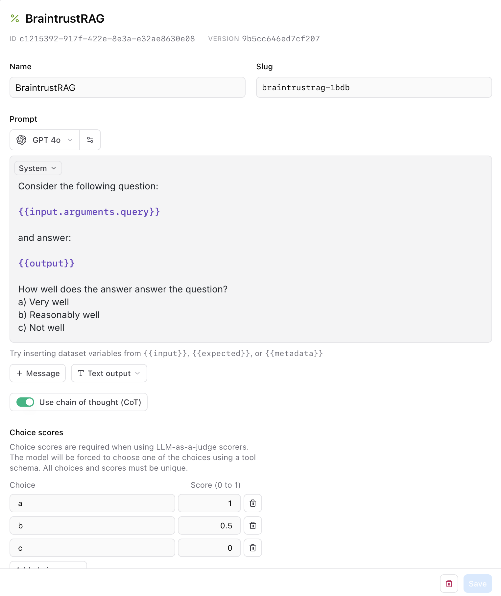
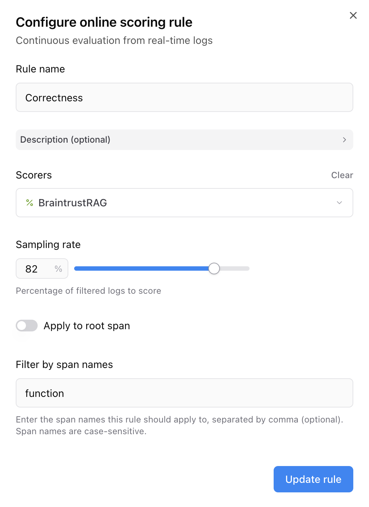
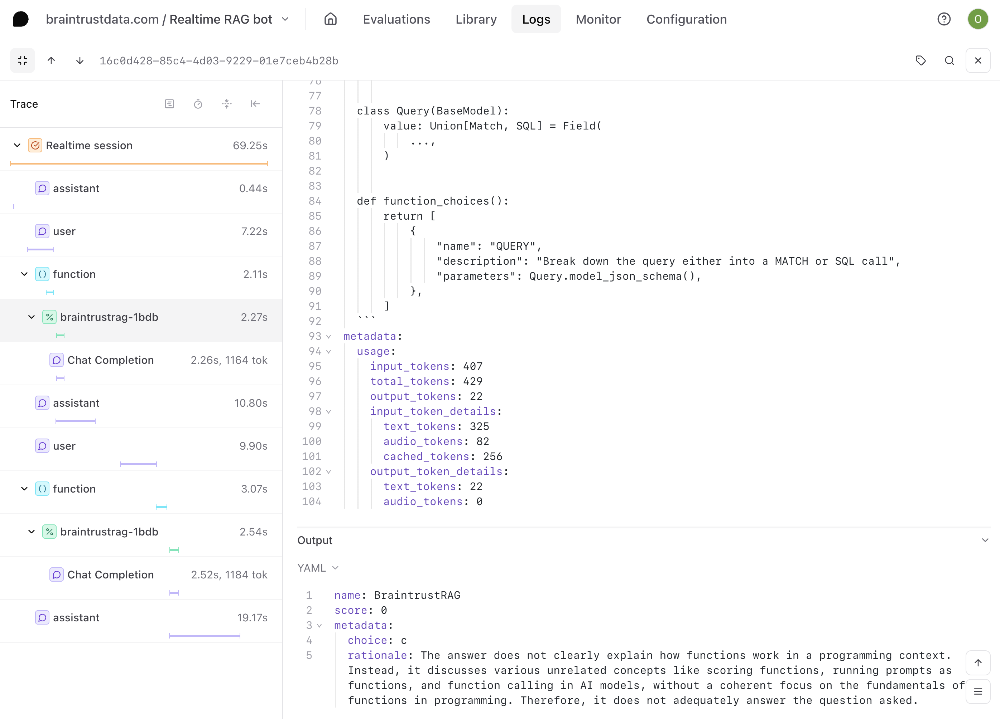
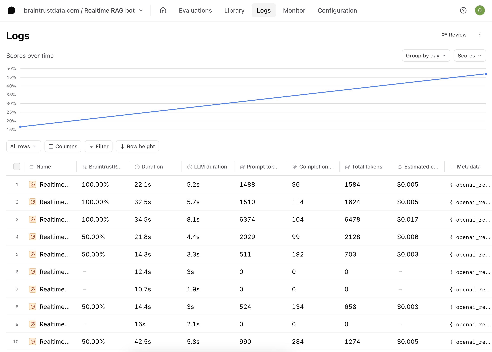

# Evaluating a speech-to-speech RAG agent built with the OpenAI Realtime API

The OpenAI [Realtime API](https://platform.openai.com/docs/guides/realtime), designed for building advanced multimodal conversational experiences, unlocks even more use cases in AI applications. However, evaluating this and other audio models' outputs in practice is an unsolved problem. In this cookbook, we'll build a robust application with the Realtime API, incorporating tool-calling and user input. Then, we'll evaluate the results. Let's get started!

## Getting started 
In this cookbook, we're going to build a speech-to-speech RAG agent that answers questions about the Braintrust documentation. 

To get started, you'll need a few accounts:

- [Braintrust](https://www.braintrust.dev/signup)
- [Pinecone](https://app.pinecone.io/?sessionType=signup)
- [OpenAI](https://platform.openai.com/signup)

and `node`, `npm`, and `typescript` installed locally. If you'd like to follow along in code,
the [realtime-rag](https://github.com/braintrustdata/braintrust-cookbook/tree/main/examples/Realtime/realtime-rag)
project contains a working example with all of the documents and code snippets we'll use.

## Clone the repo

To start, clone the repo and install the dependencies:

```bash
git clone https://github.com/braintrustdata/braintrust-cookbook.git
cd braintrust-cookbook/examples/Realtime/realtime-rag
npm install
```

Next, create a `.env.local` file with your API keys:

```bash
BRAINTRUST_API_KEY=<your-api-key>
PINECONE_API_KEY=<your-pinecone-api-key>
```

Finally, make sure to set your `OPENAI_API_KEY` environment variable in the [AI providers](https://www.braintrust.dev/app/braintrustdata.com/settings/secrets) section
of your account, and set the `PINECONE_API_KEY` environment variable in the [Environment variables](https://www.braintrust.dev/app/settings?subroute=env-vars) section.

<Callout type="info">
  We'll use the local environment variables to embed and upload the vectors, and
  the Braintrust variables to run the RAG tool and LLM calls remotely. 
</Callout>

## Upload the vectors

To upload the vectors, run the `upload-vectors.ts` script:

```bash
npx tsx upload-vectors.ts
```

This script reads all the files from the `docs-sample` directory, breaks them into sections based on headings, and creates vector embeddings for each section using OpenAI's API. It then stores those embeddings along with the section's title and content in Pinecone.

That's it for setup! Now let's dig into the code. 

## Accessing the Realtime API

Building with the OpenAI Realtime API is complex because it is built on WebSockets, and it lacks client-side authentication. However, the Braintrust [AI Proxy](/docs/guides/proxy) makes it easy to connect to the API in a secure and scalable way. The proxy securely manages your OpenAI API key, issuing [**temporary credentials**](/docs/guides/proxy#temporary-credentials-for-end-user-access) to your backend and frontend. The frontend sends any voice data from your app to the proxy, which handles secure communication with OpenAI’s Realtime API.

To access the Realtime API through the Braintrust proxy, we changed the proxy URL when instantiating the `RealtimeClient` to `https://braintrustproxy.com/v1/realtime`. In our app, the `RealtimeClient` is initialized when the `ConsolePage` component is rendered.

We set up this logic in `page.tsx`:

```typescript
import { ConsolePage } from '@/components/ConsolePage';
import './App.scss';

const PROXY_URL =
  process.env.BRAINTRUST_PROXY_URL ?? 'https://braintrustproxy.com/v1';

// You can swap this out to your OPENAI_API_KEY if you do not have a Braintrust account, but
// you will not have access to logging features.
const API_KEY = process.env.BRAINTRUST_API_KEY;

// Set this to your project name if you have one, otherwise it will default to "Realtime voice console"
const BRAINTRUST_PROJECT_NAME = process.env.BRAINTRUST_PROJECT_NAME;

export default async function Home() {
  if (!API_KEY) {
    return (
      <div>
        No API key configured server-side. Please set BRAINTRUST_API_KEY
      </div>
    );
  }

  const model = 'gpt-4o-realtime-preview-2024-10-01';
  const response = await fetch(`${PROXY_URL}/credentials`, {
    method: 'POST',
    headers: {
      'Content-Type': 'application/json',
      Authorization: `Bearer ${API_KEY}`,
    },
    body: JSON.stringify({
      model,
      logging: {
        project_name: BRAINTRUST_PROJECT_NAME || "Realtime RAG bot",
      },
      // This is the TTL for starting the conversation, but it can continue as long as needed
      // once the conversation is started.
      ttl_seconds: 60 * 10 /* 10 minutes */,
    }),
    cache: 'no-store',
  });

  if (!response.ok) {
    const text = await response.text();
    return <div><p>Failed to get credentials</p><pre>{text}</pre></div>;
  }

  const { key } = await response.json();

  return <ConsolePage apiKey={key} url={`${PROXY_URL}/realtime`} />;
}
```

<Callout>
  You can also use our proxy with an AI provider’s API key, but you will not have access to other Braintrust features, like logging.
</Callout>

## Creating a RAG tool

The retrieval logic also happens on the server side. We set up the helper function and route handler that queries Pinecone in `route.ts` so that we can call the retrieval tool on the client side like this:

```typescript
client.addTool(
      {
        name: 'pinecone_retrieval',
        description: 'Retrieves relevant information from Braintrust documentation.',
        parameters: {
          type: 'object',
          properties: {
            query: {
              type: 'string',
              description: 'The search query to find relevant documentation.'
            }
          },
          required: ['query']
        },
      },
      async ({ query }: { query: string }) => {
        try {
          setLastQuery(query);
          const results = await fetchFromPinecone(query);
          setRetrievalResults(results);
          return results
            .map(result => `[Score: ${result.score.toFixed(2)}] ${result.metadata.title}\n${result.metadata.content}`)
            .join('\n\n');
        } catch (error) {
          throw error;
        }
      }
    );
```

<Callout type="info">
Because of the way the Realtime API works, we have to use OpenAI tool calling here instead of Braintrust tool functions. 
</Callout>

## Setting up the system prompt

When we call the Realtime API, we pass it a set of instructions that are configured in `conversation_config.js`:

```javascript
export const instructions = `System settings:
Tool use: enabled.

Instructions:
- You are an AI agent responsible for helping users with questions about Braintrust
- Always use the pinecone_retrieval tool to get additional context for your responses
- You should only answer questions about Braintrust
- If you are asked a question that is irrelevant to Braintrust, give a simple and polite refusal
- Make sure there is no code in your responses, responses should be text information-based only giving as much detail as possible
- Please make sure to respond with a helpful voice via audio
- Be kind, helpful, and curteous
- It is okay to ask the user questions
- Use tools and functions you have available liberally, it is part of the training apparatus
- Be open to exploration and conversation
- Someone is relying on you - help them be as successful as possible!

Personality:
- Be upbeat and genuine
- Try speaking quickly as if excited
`;
```

Feel free to play around with the system prompt at any point, and see how it impacts the LLM's responses in the app. 

## Running the app

To run the app, navigate to `/web` and run `npm run dev`. You should have the app load on `localhost:3000`.

Start a new conversation, and ask a few questions about Braintrust. Feel free to interrupt the bot, or ask unrelated questions, and see what happens. When you're finished, end the conversation. Have a couple of conversations to get a feel for some of the limitations and nuances of the bot - each conversation will come in handy in the next step. 

## Logging in Braintrust

In addition to client-side authentication, you’ll also get the other benefits of building with Braintrust, like logging, built in. When you ran the app and connected to the Realtime API, logs were generated for each conversation. When you closed the session, the log was complete and ready to view in Braintrust. Each LLM and tool call is contained in its own span inside of the trace. In addition, the audio files were uploaded as [attachments](/blog/attachments) in your trace. This means that you don’t have to exit the UI to listen to each of the inputs and outputs for the LLM calls.


## Online evaluations

In Braintrust, you can run server-side online evaluations that are automatically run asynchronously as you upload logs. This makes it easier to evaluate your app in situations like this, where the prompt and tool might not be synced to Braintrust. 

Audio evals are complex, because there are multiple aspects of your application you can focus on. In this cookbook, we'll use the call to Pinecone as a proxy for the quality of the Realtime API's interpretation of the user's input. 

### Setting up your scorer

We'll need to create a scorer that captures the criteria we want to evaluate. Since we're dealing with complex RAG outputs, we'll use a custom LLM-as-a-judge scorer. 
For an LLM-as-a-judge scorer, you define a prompt that evaluates the output and maps its choices to specific scores. 

Navigate to **Library** > **Scorers** and create a new scorer. Call your scorer **BraintrustRAG** and add the following prompt: 

```javascript
Consider the following question:
 
{{input.arguments.query}}
 
and answer:
 
{{output}}

How well does the answer answer the question?
a) Very well
b) Reasonably well
c) Not well
```

The prompt uses mustache syntax to map the input to the query that gets sent to Pinecone, and get the output. We'll also assign choice score to the options we included in the prompt. 



### Configuring your online eval

Navigate to **Configuration** and scroll down to **Online scoring**. Select **Add rule** to configure your online scoring rule. Select the scorer we just created from the menu, and deselect **Apply to root span**. We'll filter to the **function** span since that's where our tool is called. 



The score will now automatically run at the specified sampling rate for all logs in the project.

### Viewing your evaluations

Now that you've set up your online evaluations, you can view the scores from within your logs. Underneath each function span that was included in the sampling rate, you'll have an additional span with the score. 



This particular function call was scored a 0. But if we take a closer look at the logs, we can see that the question was actually answered pretty well. 
You may notice this pattern for other logs as well - so is our function actually not performing well?

## Improving your evals 

There are three main ways to improve your evals:
- Refine the scoring function to ensure it accurately reflects the success criteria.
- Add new scoring functions to capture different performance aspects (for example, correctness or efficiency).
- Expand your dataset with more diverse or challenging test cases.

In this case, we need to be more precise about what we're testing for in our scoring function. In our application, we're asking for answers within the specific context of Braintrust, but our current scoring function is attempting to judge the responses to our questions objectively. 

Let's edit our scoring function to test for that as precisely as possible. 

### Improving our existing scorer

Let's change the prompt for our scoring function to: 

```javascript
Consider the following question from an existing Braintrust user:
 
{{input.arguments.query}}
 
and answer:
 
{{output}}

How helpful is the answer, assuming the question is always in the context of Braintrust?
a) Very helpful
b) Reasonably helpful
c) Not helpful
```

As you continue to iterate on your scoring function and generate more logs, you should aim to see your scores go up. 



## What's next

As you continue to build more AI applications with complex function calls and new APIs, it's important to continuously improve both your AI application and your evaluation process. Here are some resources to help you do just that:

- [I ran an eval. Now what?](/blog/after-evals)
- [What to do when a new AI model comes out](/blog/new-model)


