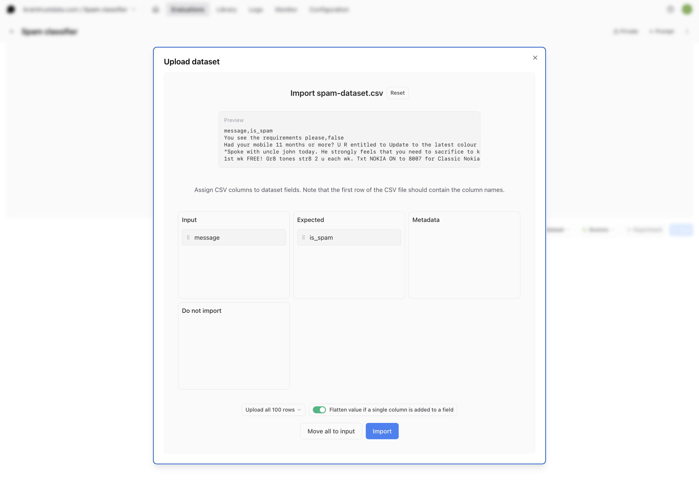
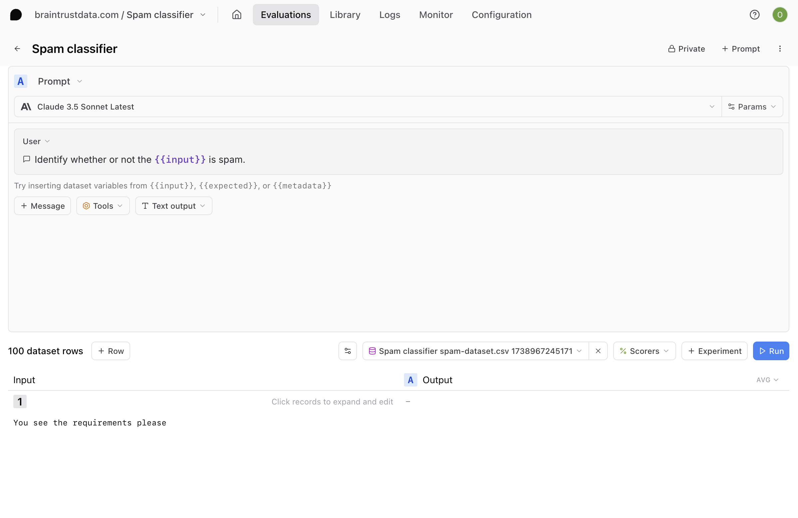
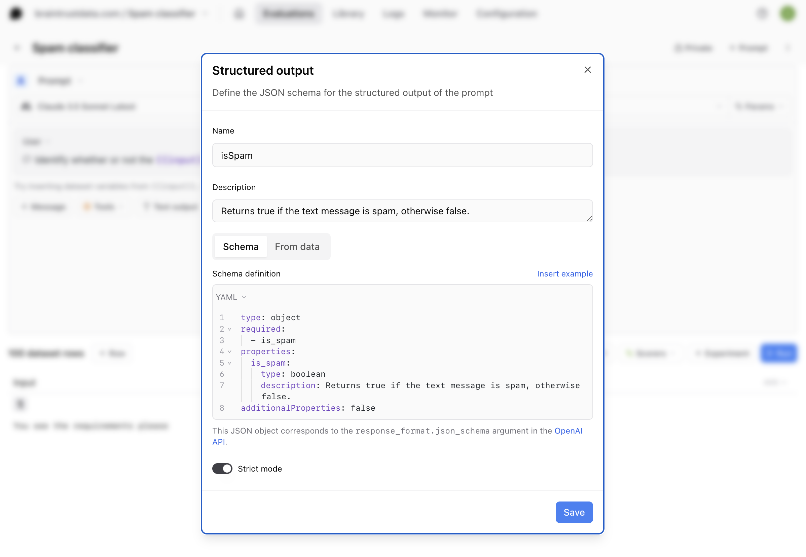
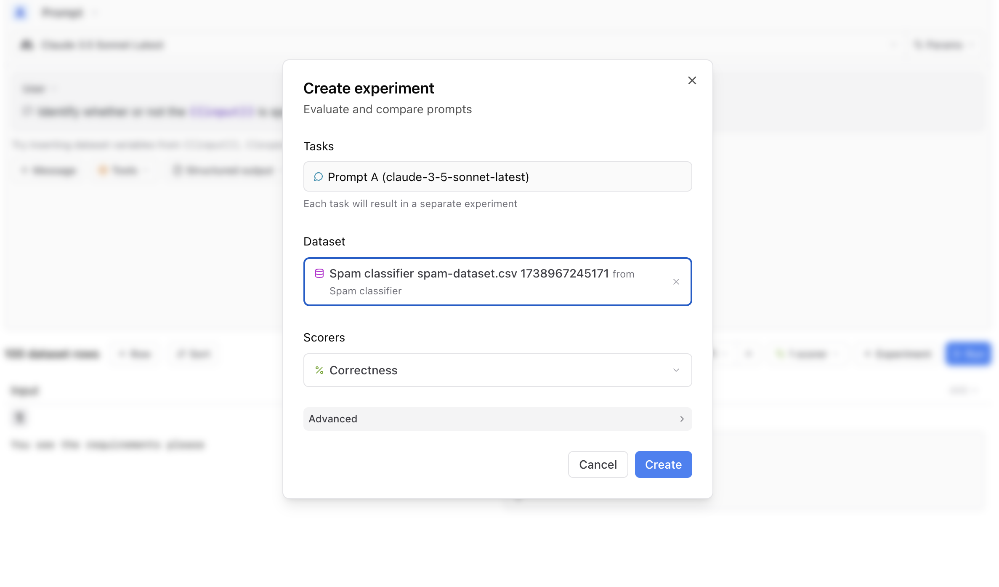
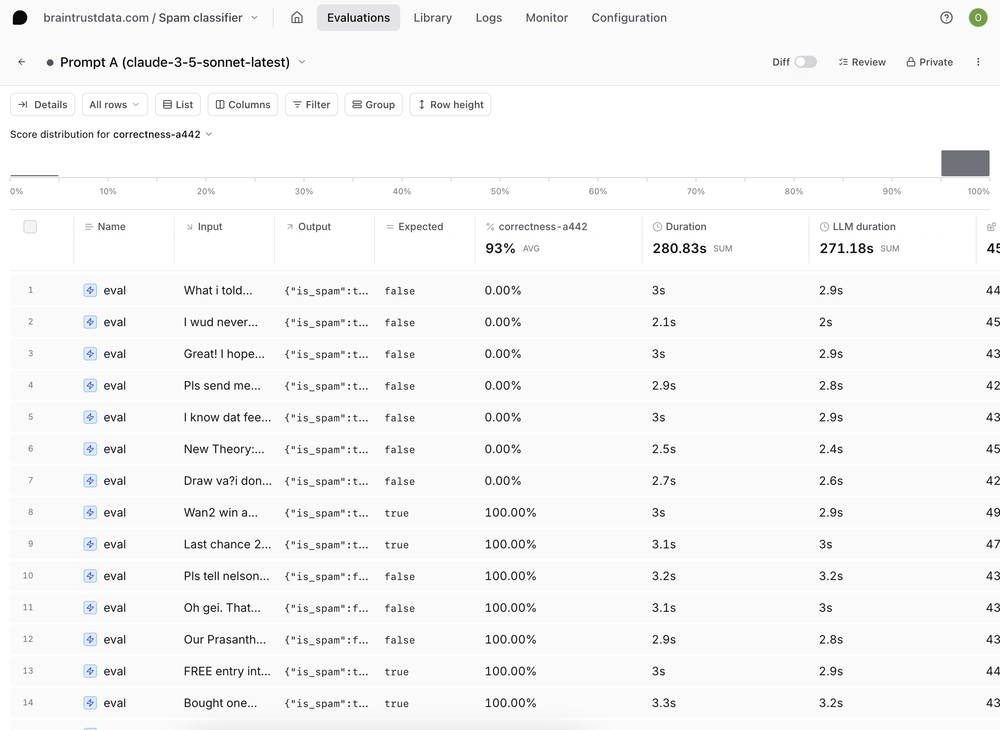

# Classifying spam using structured outputs and Anthropic models

When building AI applications that require consistent, structured responses, you have to decide how to implement structured outputs based on the LLM provider you're using.
Generally, if you're using a model from OpenAI, you'd just use [structured outputs](https://platform.openai.com/docs/guides/structured-outputs).
If you want to use models from Anthropic, however, you'd need to take a different approach and use their [Tool](https://docs.anthropic.com/en/docs/build-with-claude/tool-use) feature, or use prompt engineering to get the desired response.

In the [Braintrust Playground](https://www.braintrust.dev/docs/guides/playground), it's easy to use either AI provider with structured outputs by simply selecting **Structured output** from the output dropdown menu and defining a JSON schema. If you use the [AI proxy](/docs/guides/proxy), you can also use OpenAI SDKs in your code to speak structured outputs to Anthropic models. Structured outputs work in Braintrust for most LLMs.

In this cookbook, we'll explore how to use structured outputs and Anthropic models in the playground to classify spam in text messages.

## Getting started

Before getting started, make sure you have a [Braintrust account](https://www.braintrust.dev/signup) and an API key for [Anthropic](https://console.anthropic.com/). Make sure to plug the Anthropic key into your Braintrust account's [AI providers](https://www.braintrust.dev/app/settings?subroute=secrets) configuration. In this cookbook, we'll be working entirely in the Braintrust UI, so there's no need for a separate code editor.

## Setting up the playground

The first thing you'll need to do is create a new project. Name your project "Spam classifier." Then, navigate to **Evaluations** > **Playgrounds** and create a new playground. In Braintrust, a playground is a tool for exploring, comparing, and evaluating prompts.

## Importing a dataset

Download the [dataset](https://github.com/braintrustdata/braintrust-cookbook/tree/main/examples/SpamClassifier/spam-dataset.csv) of text messages from GitHub– it is a `.csv` file with two columns, **message** and **is_spam**. Inside your playground, select **Dataset**, then **Upload dataset**, and upload the CSV file. Using drag and drop, assign the CSV columns to dataset fields. The input column corresponds to **message**, and the expected column should be **is_spam**. Then, select **Import**.



## Writing a prompt

Recall that for this cookbook, we're going to be using Anthropic models. Choose **Claude 3.5 Sonnet Latest** or your favorite Anthropic model from the model dropdown.

Then, type this for your system prompt:

```
Identify whether or not the {{input}} is spam.
```

Prompts can use [mustache](https://mustache.github.io/mustache.5.html) templating syntax to refer to variables. In this case, the input corresponds to the text in the text message.



### Defining a structured output

Select **Structured output** from the output dropdown menu and define the JSON schema `isSpam` for the structured output of the prompt, using this code for the schema definition:

```YAML
type: object
required:
  - is_spam
properties:
  is_spam:
    type: boolean
    description: Returns true if the text message is spam, otherwise false.
additionalProperties: false
```



## Running the prompt

Selecting **Run** will run the LLM call on each input and generate an output. The output of each call will be in the format we created:

```JSON
{"is_spam": false}
```

or

```JSON
{"is_spam": true}
```

At this point, we've successfully generated a structured output response from an Anthropic model without using Tools!

## Running an eval

To close the loop, let's run an evaluation. To run an eval, you need three things:

- **Data**: a set of examples to test your application on
- **Task**: the AI function you want to test (any function that takes in an input and returns an output)
- **Scores**: a set of scoring functions that take an input, output, and optional expected value and compute a score

In this example, the Data is the dataset you uploaded, and the Task is the prompt you created, so all we need is a scoring function.

### Creating a custom scorer

A scoring function allows you to compare the expected output of a task to the actual output and produce a score between 0 and 1. Inside your playground, select **Scorers** to choose from several types of scoring functions. For this example, since we have the expected classifications from the dataset, we can create a scoring function that measures whether or not the LLM output matches the expected classification.

Select **Scorers**, then **Create custom scorer**. We'll create a custom TypeScript scorer called "Correctness" that compares the value of `output.is_spam` to the expected classification:

```TypeScript
function handler({
  output,
  expected
}: {
  output: boolean;
  expected: boolean | string;
}): number {
  if (expected === null) return 0;

  // Convert 'expected' to a boolean if it's a string
  const expectedBool = (expected === 'true') ? true : (expected === 'false') ? false : expected;

  return output.is_spam === expectedBool ? 1 : 0;
}
```

Now that you have your dataset, prompt, and scoring function set up, you can select **+ Experiment** to run a full evaluation.



### Interpreting your results

Navigate to the **Experiments** page to view your evaluation.


Examine the scores generated by your evals. If you notice that some of your outputs did not match what was expected, you can tweak your prompt directly in the UI until it consistently produces high-quality outputs.

If changing the prompt doesn't yield the desired results, you can experiment with different models. Since most models have structured output capabilities in Braintrust, this is as simple as choosing a different model from the dropdown menu in a prompt. As you iterate on your prompt, you can run more experiments and compare results.

## Next steps

In addition to changing your prompt definition and model, you can also:

- Add more [custom scorers](/docs/guides/functions/scorers#custom-scorers)
- Use a larger or more custom [dataset](/docs/guides/datasets)
- Write more complex [structured output](/docs/guides/functions/prompts#structured-outputs) JSON schema
