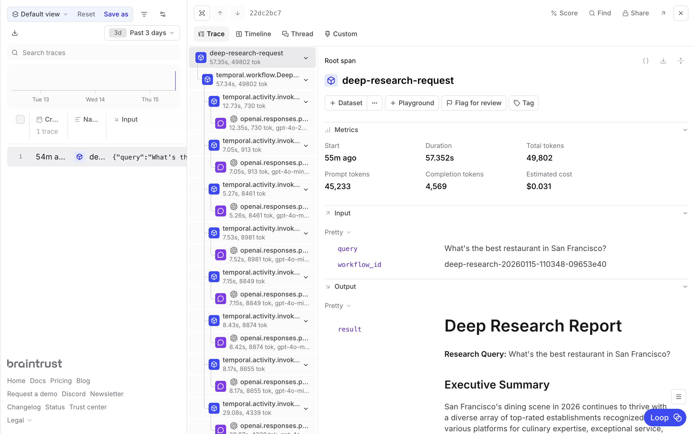

# Building a deep research agent with Temporal

Deep research systems combine multiple agents with web retrieval to produce evidence-based reports. These tasks can involve dozens of searches and hundreds of documents, creating failure modes that [Temporal's](https://temporal.io/) durable execution helps protect against. This cookbook shows you how to build a deep research system with Temporal workflows and Braintrust observability.

By the end of this cookbook, you'll learn how to:

- Build a multi-agent system with four specialized research agents
- Use Temporal workflows for durable, resilient AI task execution
- Add Braintrust tracing to debug and improve agent performance
- Use structured outputs to ensure reliable communication between agents

## The deep research architecture

The system uses four specialized agents, each implemented as a Temporal activity:

1. **[Planning](#research-planning-agent)** - Decomposes the research question into specific aspects with priorities
2. **[Query generation](#query-generation-agent)** - Creates optimized search queries for each aspect
3. **[Web search](#web-search-agent)** - Retrieves and analyzes relevant documents
4. **[Report synthesis](#report-synthesis-agent)** - Combines findings into a comprehensive report

The [workflow](#creating-the-workflow) orchestrates these agents, executing searches in parallel and continuing with partial results if some fail.

## Getting started

To get started, you'll need:

- A [Braintrust account](https://www.braintrust.dev/signup) and API key
- An [OpenAI API key](https://platform.openai.com/)
- The [Temporal CLI](https://docs.temporal.io/cli)
- [uv](https://docs.astral.sh/uv/) for Python package management

Set the required environment variables:

```bash
export OPENAI_API_KEY="your-openai-api-key"
export BRAINTRUST_API_KEY="your-braintrust-api-key"
export BRAINTRUST_PROJECT_NAME="deep-research"  # optional
```

Clone the cookbook and install dependencies:

```bash
git clone https://github.com/braintrustdata/braintrust-cookbook.git
cd braintrust-cookbook/examples/TemporalDeepResearch/temporal-deep-research
uv sync
```

## Running the example

This example requires three terminal tabs:

**Terminal 1** - Start the Temporal dev server:

```bash
temporal server start-dev
```

**Terminal 2** - Run the worker:

```bash
uv run python -m worker
```

**Terminal 3** - Start a research query:

```bash
uv run python -m start_workflow "What's the best restaurant in San Francisco?"
```

## Creating the data structures

We use Pydantic models to ensure information passes between agents in a structured way. The complete models are in [`agents/shared.py`](https://github.com/braintrustdata/braintrust-cookbook/blob/main/examples/TemporalDeepResearch/temporal-deep-research/agents/shared.py).

The planning agent creates a `ResearchPlan`:

```python
class ResearchPlan(BaseModel):
    research_question: str
    key_aspects: List[ResearchAspect]
    expected_sources: List[str]
    search_strategy: str
    success_criteria: List[str]
```

The query generation agent creates search queries:

```python
class SearchQuery(BaseModel):
    query: str
    rationale: str
    expected_info_type: str
    priority: int
```

The web search agent returns results with findings and citations:

```python
class SearchResult(BaseModel):
    query: str
    sources: List[str]
    key_findings: str
    relevance_score: float
    citations: List[str]
```

The report synthesis agent creates the final report:

```python
class ResearchReport(BaseModel):
    executive_summary: str
    detailed_analysis: str
    key_findings: List[str]
    confidence_assessment: str
    citations: List[str]
    follow_up_questions: List[str]
```

## Building the agents

Each agent is implemented as a Temporal activity that calls OpenAI's API. We use a shared [`invoke_model`](https://github.com/braintrustdata/braintrust-cookbook/blob/main/examples/TemporalDeepResearch/temporal-deep-research/activities/invoke_model.py) activity that handles API calls with Braintrust tracing.

### Research planning agent

The research planning agent analyzes the query and creates a comprehensive strategy. It decomposes the question into 3-7 key aspects, identifies expected source types, and defines success criteria:

```python
RESEARCH_PLANNING_INSTRUCTIONS = """
You are a research planning specialist who creates focused research strategies.

CORE RESPONSIBILITIES:
1. Decompose the user's question into 3-7 key research aspects
2. Identify required sources and evidence types
3. Design a practical search strategy
4. Set clear success criteria
"""

async def plan_research(query: str) -> ResearchPlan:
    result = await workflow.execute_activity(
        invoke_model,
        InvokeModelRequest(
            model=COMPLEX_REASONING_MODEL,
            instructions=RESEARCH_PLANNING_INSTRUCTIONS,
            input=f"Research query: {query}",
            response_format=ResearchPlan,
        ),
        start_to_close_timeout=timedelta(seconds=300),
    )
    return result.response
```

The complete implementation is in [`agents/research_planning.py`](https://github.com/braintrustdata/braintrust-cookbook/blob/main/examples/TemporalDeepResearch/temporal-deep-research/agents/research_planning.py).

<Note>
  Setting an appropriate `start_to_close_timeout` is critical. If it's too
  short, the activity will fail with a timeout error, causing a retry loop.
  Response times for reasoning models can vary significantly depending on query
  complexity.
</Note>

### Query generation agent

The query generation agent converts the research plan into optimized web search queries. It targets different information types (factual data, expert analysis, case studies, and recent news) using varied query styles and temporal modifiers:

```python
QUERY_GENERATION_INSTRUCTIONS = """
You are a search query specialist who crafts effective web searches.

CORE RESPONSIBILITIES:
1. Generate 3-5 diverse search queries based on the research plan
2. Balance specificity with discoverability
3. Target different information types (factual, analytical, recent, historical)
"""

async def generate_queries(research_plan: ResearchPlan) -> QueryPlan:
    result = await workflow.execute_activity(
        invoke_model,
        InvokeModelRequest(
            model=EFFICIENT_PROCESSING_MODEL,
            instructions=QUERY_GENERATION_INSTRUCTIONS,
            input=plan_context,
            response_format=QueryPlan,
        ),
        start_to_close_timeout=timedelta(seconds=300),
    )
    return result.response
```

The complete implementation is in [`agents/research_query_generation.py`](https://github.com/braintrustdata/braintrust-cookbook/blob/main/examples/TemporalDeepResearch/temporal-deep-research/agents/research_query_generation.py).

### Web search agent

The web search agent executes searches using OpenAI's web search tool. It prioritizes authoritative sources like academic papers, government sites, and established news outlets, then extracts key findings with proper citations and relevance scores:

```python
WEB_SEARCH_INSTRUCTIONS = """
You are a web research specialist who finds and evaluates information.

CORE RESPONSIBILITIES:
1. Execute web searches using the web search tool
2. Prioritize authoritative sources
3. Extract key information relevant to the research question
4. Provide proper citations and assess reliability
"""

async def search_web(query: SearchQuery) -> SearchResult:
    result = await workflow.execute_activity(
        invoke_model,
        InvokeModelRequest(
            model=EFFICIENT_PROCESSING_MODEL,
            instructions=WEB_SEARCH_INSTRUCTIONS,
            input=search_input,
            response_format=SearchResult,
            tools=[{"type": "web_search"}],
        ),
        start_to_close_timeout=timedelta(seconds=300),
    )
    return result.response
```

The complete implementation is in [`agents/research_web_search.py`](https://github.com/braintrustdata/braintrust-cookbook/blob/main/examples/TemporalDeepResearch/temporal-deep-research/agents/research_web_search.py).

### Report synthesis agent

The report synthesis agent combines all research findings into a comprehensive, well-cited report. It weighs authoritative sources more heavily, addresses contradictory findings transparently, and generates follow-up questions for deeper research:

```python
REPORT_SYNTHESIS_INSTRUCTIONS = """
You are a research synthesis expert who creates comprehensive reports.

CORE RESPONSIBILITIES:
1. Synthesize all research into a coherent narrative
2. Structure information logically with evidence support
3. Provide comprehensive citations
4. Assess confidence levels and acknowledge limitations
"""

async def generate_synthesis(
    original_query: str, research_plan: ResearchPlan, search_results: List[SearchResult]
) -> ResearchReport:
    result = await workflow.execute_activity(
        invoke_model,
        InvokeModelRequest(
            model=COMPLEX_REASONING_MODEL,
            instructions=REPORT_SYNTHESIS_INSTRUCTIONS,
            input=synthesis_input,
            response_format=ResearchReport,
        ),
        start_to_close_timeout=timedelta(seconds=300),
    )
    return result.response
```

The complete implementation is in [`agents/research_report_synthesis.py`](https://github.com/braintrustdata/braintrust-cookbook/blob/main/examples/TemporalDeepResearch/temporal-deep-research/agents/research_report_synthesis.py).

## Creating the workflow

The [`DeepResearchWorkflow`](https://github.com/braintrustdata/braintrust-cookbook/blob/main/examples/TemporalDeepResearch/temporal-deep-research/workflows/deep_research_workflow.py) orchestrates the four-phase research process:

```python
@workflow.defn
class DeepResearchWorkflow:
    @workflow.run
    async def run(self, query: str) -> str:
        # Step 1: Research Planning
        research_plan = await plan_research(query)

        # Step 2: Query Generation
        query_plan = await generate_queries(research_plan)

        # Step 3: Web Search (parallel execution with resilience)
        search_results = await self._execute_searches(query_plan.queries)

        if not search_results:
            raise ApplicationError(
                "All web searches failed - cannot generate report",
                non_retryable=True,
            )

        # Step 4: Report Synthesis
        final_report = await generate_synthesis(query, research_plan, search_results)

        return self._format_final_report(query, final_report)
```

The workflow executes searches in parallel and continues with partial results if some fail:

```python
async def _execute_searches(self, search_queries) -> List[SearchResult]:
    async def execute_single_search(search_query):
        try:
            return await search_web(search_query)
        except Exception as e:
            workflow.logger.exception(f"Search failed: {e}")
            return None

    search_tasks = [execute_single_search(q) for q in search_queries]
    results = await asyncio.gather(*search_tasks)
    return [r for r in results if r is not None]
```

## Adding observability

Multi-agent systems like deep research are notoriously difficult to debug. When a report contains incorrect information, you need to trace back through the planning, query generation, and search phases to understand what went wrong. Did the planner miss a key aspect? Did a search query return irrelevant results? Did the synthesis agent misinterpret the findings?

With the `BraintrustPlugin`, you get automatic tracing for every workflow and activity execution. It captures the full execution graph, including parallel searches and retries:

```python
from braintrust import init_logger
from braintrust.contrib.temporal import BraintrustPlugin

init_logger(project=os.environ.get("BRAINTRUST_PROJECT_NAME", "deep-research"))

worker = Worker(
    client,
    task_queue="deep-research-task-queue",
    workflows=[DeepResearchWorkflow],
    activities=[invoke_model.invoke_model],
    plugins=[BraintrustPlugin()],
)
```

The `invoke_model` activity wraps the OpenAI client with Braintrust for detailed LLM call tracing:

```python
client = wrap_openai(AsyncOpenAI())
resp = await client.responses.parse(**kwargs)
```

In the Braintrust logs, you'll see the complete trace for each research request, including:

- The research plan generated by the planning agent
- Each search query and its rationale
- Web search results with relevance scores
- The final synthesized report



This visibility is essential for improving agent performance over time. You can identify which types of queries produce low-relevance results, spot patterns in planning failures, and build [evaluation datasets](/docs/annotate/datasets) from real research traces to systematically improve each agent.

## Next steps

- Explore your research traces in [Braintrust logs](/docs/observe/view-logs)
- Learn more about [evaluating agents](/docs/cookbook/recipes/AgentWhileLoop) and measuring performance
- Build [datasets](/docs/annotate/datasets) from your traces to improve agent prompts
- Read more about [Temporal workflows](https://docs.temporal.io/workflows)
