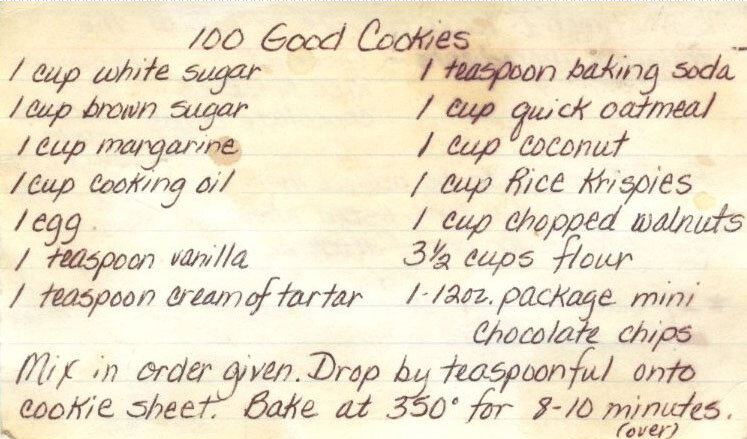

# Using Python functions to extract text from images

From digitizing and archiving images of your handwritten notes, to automating invoice processing, there are a multitude of reasons you’d want to extract text from an image. You could use an LLM for image processing, but doing so can sometimes be inaccurate, expensive, and slow. Optical character recognition, or OCR, is a great pre-processing step that allows you to convert raw image data into text that can then be processed or summarized by an LLM.

Maybe you find the perfect recipe on the internet, but it’s surrounded by ads and people’s life stories, or you want to digitize an old recipe written by your grandmother.



You also want the recipes to be in a specific format so you can quickly shop for groceries. You build an app to accomplish this, but you're getting mixed results. In Braintrust, you can create the OCR text extraction tool and experiment with different LLM prompts side-by-side in the playground. This way, your formatting will be just right, and you can deploy the perfect version. Let’s walk through this workflow step by step.

## Getting started

To get started, you'll need a few accounts:

- [Braintrust](https://www.braintrust.dev/signup)
- [OpenAI](https://platform.openai.com/signup)

and `python` and `pip` installed locally. If you'd like to follow along in code,
the [tool-ocr](https://github.com/braintrustdata/braintrust-cookbook/tree/main/examples/ToolOCR/tool-ocr)
project contains a working example with all the code snippets we'll use.

## Clone the repo

To start, clone the repo and install the dependencies:

```bash
git clone https://github.com/braintrustdata/braintrust-cookbook.git
cd braintrust-cookbook/examples/ToolOCR/tool-ocr
pip install
```

Next, create a `.env` file with your Braintrust API key:

```bash
BRAINTRUST_API_KEY=<your-api-key>
```

Finally, make sure to set your `OPENAI_API_KEY` environment variable in the [AI providers](https://www.braintrust.dev/app/braintrustdata.com/settings/secrets) section
of your account.

## Creating an OCR tool

Optical character recognition, or OCR, is any type of technology that converts images of typed, handwritten or printed text into machine-encoded text. There are many well known libraries for OCR — in this cookbook, we’ll use [OCR.Space](https://ocr.space/), a free API you can use for testing without creating an account.

<Callout type="info">
  For this cookbook, we're using the free version of OCR.Space that limits the
  number of requests. You may exceed rate limits and need to upgrade your
  account to experiment further with this application.
</Callout>

In Braintrust, you can create tools and then run them in the UI, API, and, of course, via prompts. This will make it easier to iterate on your prompt without having to worry about the OCR logic.

The OCR tool is defined in `ocr.py`:

```python #skip-compile
def ocr_image(**kwargs) -> str:
    # Parse input arguments
    args = Args(**kwargs)

    # OCR.Space API endpoint and payload
    api_url = "https://api.ocr.space/parse/imageurl"
    payload = {
        "apikey": "helloworld",  # Free tier API key
        "url": args.image_url,
        "language": "eng",
        "OCREngine": "2",
        "scale": "true",
    }

    # Make the API request
    try:
        response = requests.get(api_url, params=payload)
        response.raise_for_status()
        result = response.json()

        # Handle errors in the OCR response
        if result.get("IsErroredOnProcessing", False):
            raise ValueError(f"OCR error: {result.get('ErrorMessage', 'Unknown error')}")

        # Extract and return the parsed text
        return result["ParsedResults"][0]["ParsedText"] if "ParsedResults" in result else "No text detected."
    except Exception as e:
        raise ValueError(f"Failed to perform OCR: {e}")
```

In just a few lines of code, it takes an image URL, parses and extracts the text, and returns the text contained in the image.

To push the tool to Braintrust along with all its dependencies, run:

```bash
braintrust push ocr.py --requirements requirements.txt
```

### Try out the tool

To try out the tool, visit the **toolOCR** project in Braintrust, and navigate **Tools**. Here, you can test different images and see what kinds of outputs you're getting from the tool.


This is helpful information for deciding if you'd like to do any additional post processing to the text output. For example, you may notice that your output contains `/n` to indicate new lines in the parsed text. You could include additional processing in your tool to do this. If you change your code, just run `braintrust push ocr.py --requirements requirements.txt` again to sync the tool with Braintrust.

## Try out the prompt

When we pushed the tool to Braintrust, we also included an initial definition of the prompt:

```python #skip-compile
prompt = project.prompts.create(
    name= "Recipe text generator",
    messages= [{"role": "system", "content": "You are a helpful assistant that turns images of recipes into text-based grocery lists that are organized by category.",},
        {"role": "user", "content": "{{{image}}}",},
    ],
    model= "gpt-4o-mini",
    tools= [ocr_tool],
    if_exists= "replace",
)
```

Just like the tool, you can run it in the UI and even try it out on some examples:


If you visit the **Logs** tab, you can check out detailed logs for each call:


<Callout type="info">
  We recommend using code-based prompts to initialize projects, but we'll show
  how convenient it is to tweak your prompts in the UI in a moment.
</Callout>

## Create a playground

To try out the prompt together with some data, we'll create a playground. Scroll to the bottom of your prompt modal and select **Create playground with prompt**.

In the `tool-ocr` project, we set up a [script](https://github.com/braintrustdata/braintrust-cookbook/tree/main/examples/ToolOCR/tool-ocr/dataset.py) for you that will upload a sample dataset of recipe images. To upload the dataset to Braintrust, run:

```bash
python dataset.py
```

Then, navigate to **Dataset** in your playground and select the **Recipes** dataset.

Your playground is now set up with a prompt, model choice, dataset, and the tool we created. Hit **Run** to run the prompt and tool on the images in the dataset.


## Iterating on the prompt

Now that we have an interactive environment to test out our prompt and tool call, we can tweak the prompt and model until we get the desired results.

Hit the copy icon to duplicate your prompt and start tweaking. You can also tweak the original prompt and save your changes there if you'd like. For example, you can try instructing the model to always list the quantity of each ingredient you need to purchase.


Once you're satisfied with the prompt, hit **Update** to save the changes. Each time you save the prompt, you
create a new version. To learn more about how to use a prompt in your code, check out the
[prompts guide](/docs/core/functions/prompts#using-prompts-in-your-code).

## Next steps

Now that you've written tool and prompt Python functions in Braintrust, you can:

- [Deploy the prompt in your app](/docs/core/functions/prompts#using-prompts-in-your-code)
- [Conduct more detailed evaluations](/docs/core/experiments)
- Learn about [logging LLM calls](/docs/core/logs) to create a data flywheel
