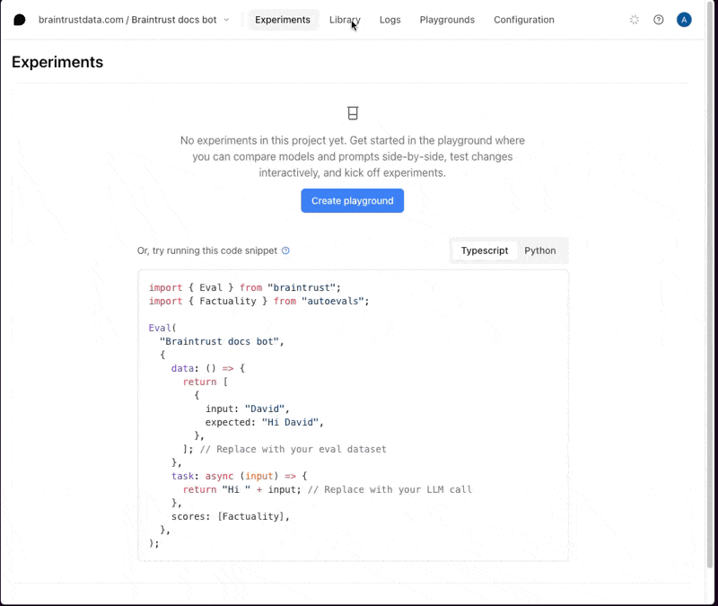
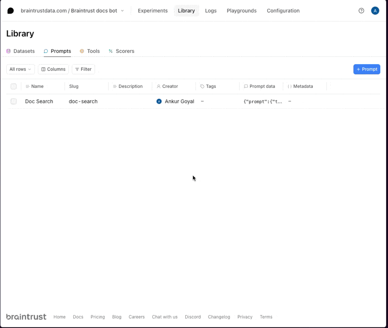
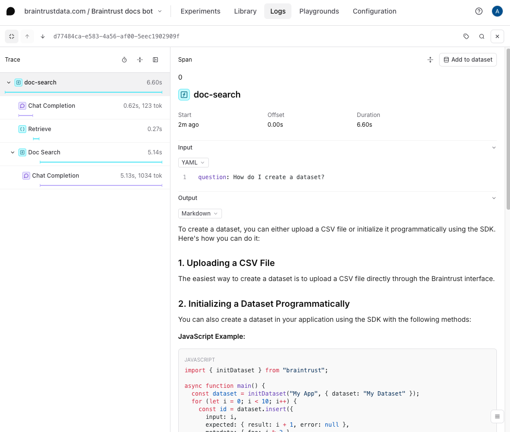
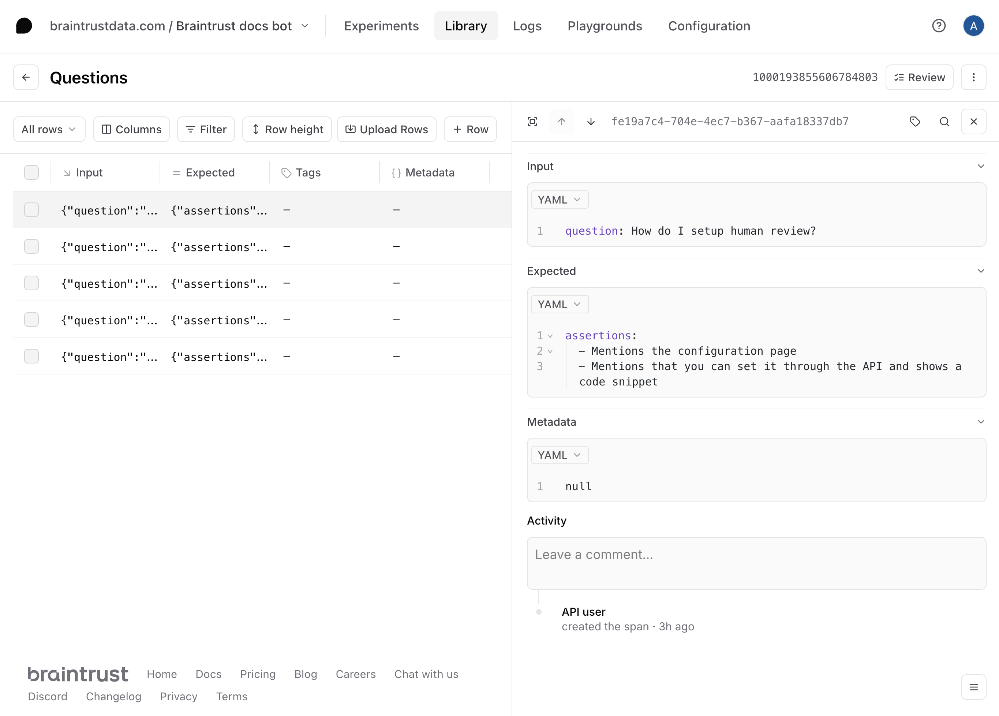
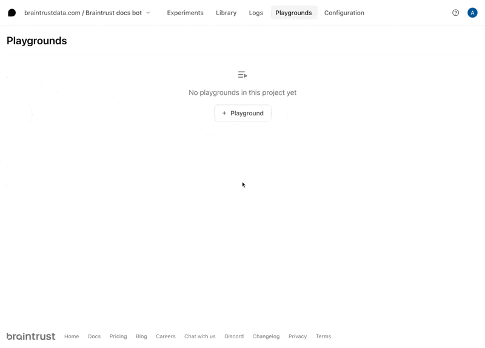
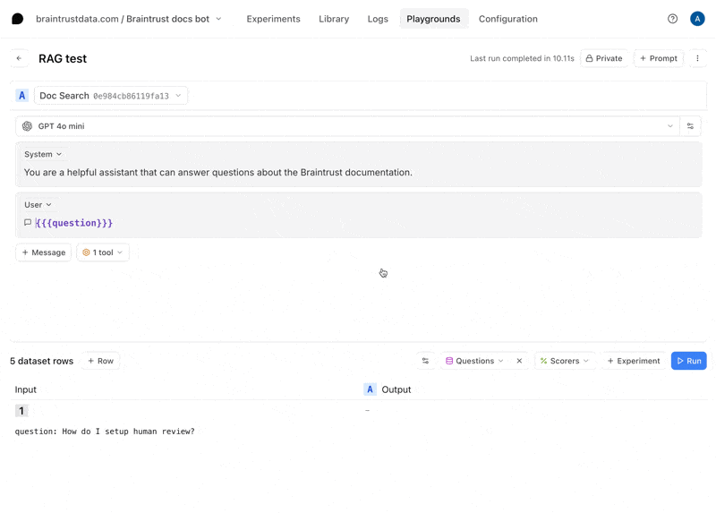
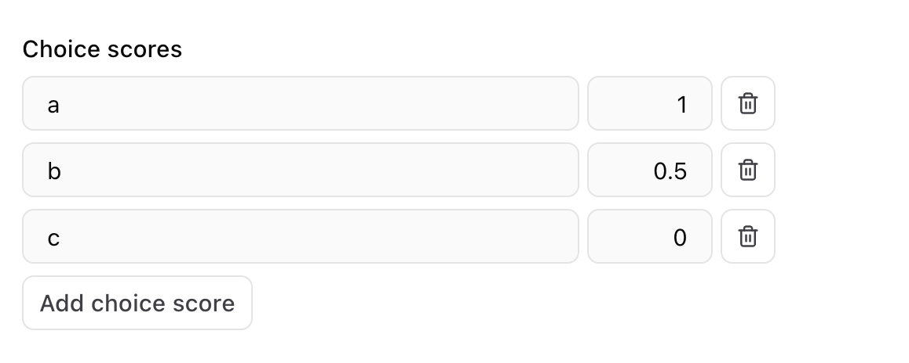
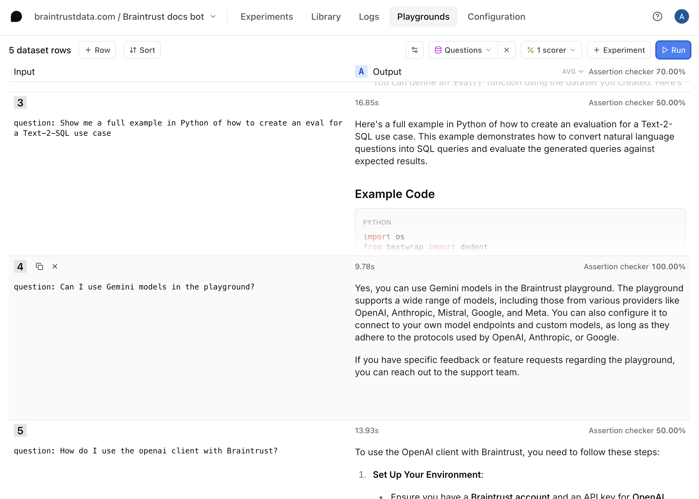
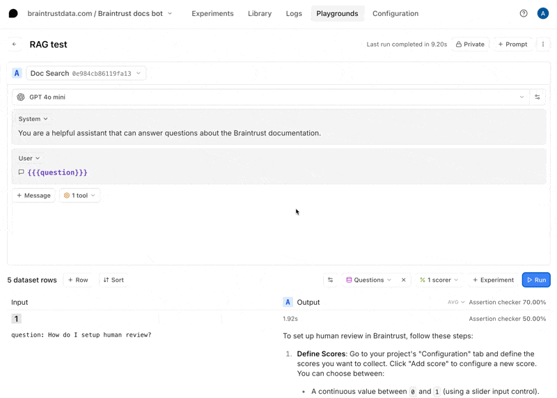
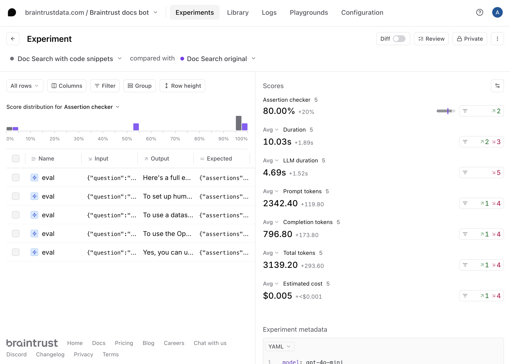

# Iterating on a RAG app without redeploying code

Let's say you've built an AI agent to answer questions about your documentation and receive some feedback from users that it doesn't produce
enough code examples in its responses. Normally, you would have to jump into your codebase, tweak the prompt, and try out the changes. If you want
to compare multiple versions side-by-side, you'd have to deploy each version separately.

Using Braintrust, you can experiment with different
prompts together with retrieval logic, side-by-side, all within the playground UI. In this cookbook, we'll walk through exactly how.


## Architecture

Retrieval augmented generation (RAG) is a powerful technique for adding context to your LLM responses. However, the retrieval step involves API calls
and therefore you usually need to iterate on RAG applications in your codebase. Braintrust offers an alternative workflow, where instead, you
`push` the retrieval tool from your codebase to Braintrust. Using Braintrust functions, a RAG agent can be defined as just two components:

- A system prompt containing instructions for how to retrieve content and synthesize answers
- A vector search tool, implemented in TypeScript, which embeds a query, searches for relevant documents, and returns them

In this cookbook, we'll define an agent that answers questions about the Braintrust documentation, iterate on it in the Braintrust playground, and use
scorer functions to evaluate the results.

## Getting started

To get started, you'll need a few accounts:

- [Braintrust](https://www.braintrust.dev/signup)
- [MongoDB Atlas](https://www.mongodb.com/cloud/atlas/register)
- [OpenAI](https://platform.openai.com/signup)

and `node`, `npm`, and `typescript` installed locally. If you'd like to follow along in code,
the [tool-rag](https://github.com/braintrustdata/braintrust-cookbook/tree/main/examples/ToolRAG/tool-rag)
project contains a working example with all of the documents and code snippets we'll use.

## Clone the repo

To start, clone the repo and install the dependencies:

```bash
git clone https://github.com/braintrustdata/braintrust-cookbook.git
cd braintrust-cookbook/examples/ToolRAG/tool-rag
npm install
```

Next, create a `.env.local` file with your API keys:

```bash
BRAINTRUST_API_KEY=<your-api-key>
MONGO_URI=<your-mongodb-uri>
```

Finally, make sure to set your `OPENAI_API_KEY` environment variable in the [AI providers](https://www.braintrust.dev/app/braintrustdata.com/settings/secrets) section
of your account, and set the `PINECONE_API_KEY` environment variable in the [Environment variables](https://www.braintrust.dev/app/settings?subroute=env-vars) section.

<Callout type="info">
  We'll use the local environment variables to embed and upload the vectors, and
  the Braintrust variables to run the RAG tool and LLM calls remotely.
</Callout>

## Upload the vectors

To upload the vectors, run the `upload-vectors.ts` script:

```bash
npx tsx upload-vectors.ts
```

This script reads all the files from the `docs-sample` directory, breaks them into sections based on headings, and creates vector embeddings for each section using OpenAI's API. It then stores those embeddings along with the section's title and content in Pinecone.

That's it for setup! Now let's try to retrieve the vectors using Braintrust.

## Creating a RAG tool

Braintrust makes it easy to create tools and then run them in the UI, API, and, of course, via prompts. This is
an easy way to iterate on assistant-style agents.

The retrieval tool is defined in `retrieval.ts`:

```javascript
async ({ query, top_k }) => {
  const embedding = await openai.embeddings
    .create({
      input: query,
      model: "text-embedding-3-small",
    })
    .then((res) => res.data[0].embedding);

  const queryResponse = await pc.query({
    vector: embedding,
    topK: top_k,
    includeMetadata: true,
  });

  return queryResponse.matches.map((match) => ({
    title: match.metadata?.title,
    content: match.metadata?.content,
  }));
};
```

In just a few lines of code, it takes a search query, converts it into a numerical vector using OpenAI's embedding model, and then sends that vector to Pinecone to find the most similar items stored in the database. It retrieves the top results based on similarity and returns key information (title and content) from the matching items.

To push the tool to Braintrust, run:

```bash
npx braintrust push retrieval.ts
```

The output should be:

```
1 file uploaded successfully
```

### Try out the tool

To try out the tool, visit the project in Braintrust, and navigate to the **Tools** section of your **Library**.



Here, you can test different searches and refine the logic. For example, you could try playing with various
`top_k` values, or adding a prefix to the query to guide the results. If you change the code, run
`npx braintrust push retrieval.ts` again to update the tool.

## Writing a prompt

Next, let's wire the tool into a prompt. In `prompt.ts`, there's an initial definition of the prompt:

```javascript
  messages: [
    {
      role: "system",
      content:
        "You are a helpful assistant that can " +
        "answer questions about the Braintrust documentation.",
    },
    {
      role: "user",
      content: "{{{question}}}",
    },
  ],
```

Run the following command to initialize the prompt:

```
npx braintrust push prompt.ts
```

Once the prompt uploads, you can run it in the UI and even try it out on some examples:



If you visit the **Logs** tab, you can check out detailed logs for each call:



<Callout type="info">
  We recommend using code-based prompts to initialize projects, but we'll show
  how convenient it is to tweak your prompts in the UI in a moment.
</Callout>

## Import a dataset

To get a better sense of how well this prompt and tool work, let's upload a dataset with
a few questions and assertions. The assertions allow us to test specific characteristics
about the answers, without spelling out the exact answer itself.

The dataset is defined in `questions-dataset.ts`, and you can upload it by running:

```bash
npx tsx questions-dataset.ts
```

Once you create it, if you visit the **Datasets** tab, you'll be able to explore it:



## Create a playground

To try out the prompt together with the dataset, we'll create a playground.



Once you create the playground, hit **Run** to run the prompt and tool on the questions
in the dataset.



### Define a scorer

Now that we have an interactive environment to test out our prompt and tool call, let's define
a scorer that helps us evaluate the results.

Select the **Scorers** dropdown menu, then **Create custom scorer**. Choose the **LLM-as-a-judge** tab, and enter

```javascript
Consider the following question:

{{input.question}}

and answer:

{{output}}

Does the answer satisfy each of the following assertions? Meticulously check each one, and write out your reasoning in the rationale section.

{{#expected.assertions}}
{{.}}
{{/expected.assertions}}

a) It correctly satisfies every assertion.
b) It satisfies some of the assertions
c) It satisfies none of the assertions
```

For the choice scores, configure (a) as 1, (b) as 0.5, and (c) as 0.



Once you define the scorer, hit **Run** to run it on the questions in the dataset.



### Tweak the prompt

Now, let's tweak the prompt to see if we can improve the results. Hit the copy icon to duplicate your prompt and start tweaking. You can also tweak the original prompt and save your changes there if you'd like. For example, you can try instructing the model to always include a Python and
TypeScript code snippet.



Once you're satisfied with the prompt, hit **Update** to save the changes. Each time you save the prompt, you
create a new version. To learn more about how to use a prompt in your code, check out the
[prompts guide](/docs/guides/prompts#using-prompts-in-your-code).

## Run full experiments

The playground is very interactive, but if you'd like to create a more detailed evaluation, where you can:

- See every step, including the tool calls and scoring prompts
- Compare side-by-side diffs, improvements, and regressions
- Share a permanent snapshot of results with others on your team

then you can run a full experiment by selecting **+Experiments**. Once you run the experiments, you can dig in further to the full analysis:



## Next steps

Now that you've built a RAG app in Braintrust, you can:

- [Deploy the prompt in your app](/docs/guides/prompts#using-prompts-in-your-code)
- [Conduct more detailed evaluations](/docs/guides/evals)
- Learn about [logging LLM calls](/docs/guides/logging) to create a data flywheel
