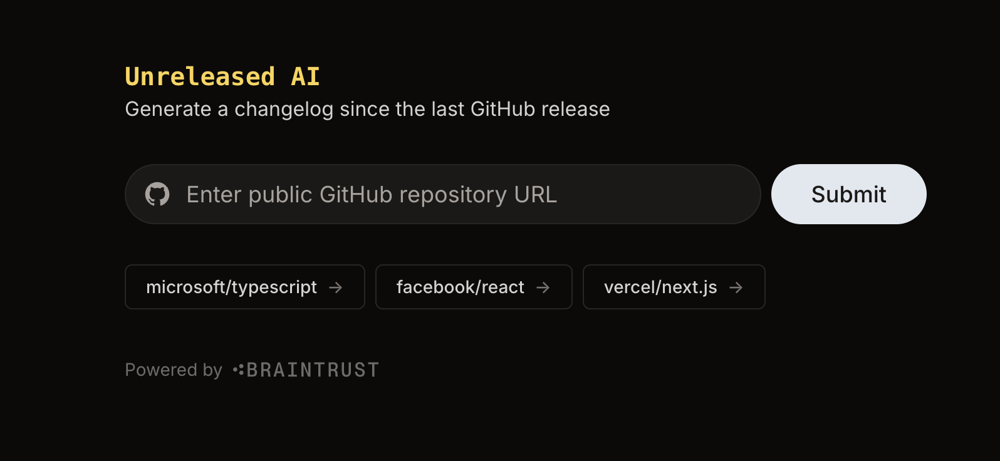
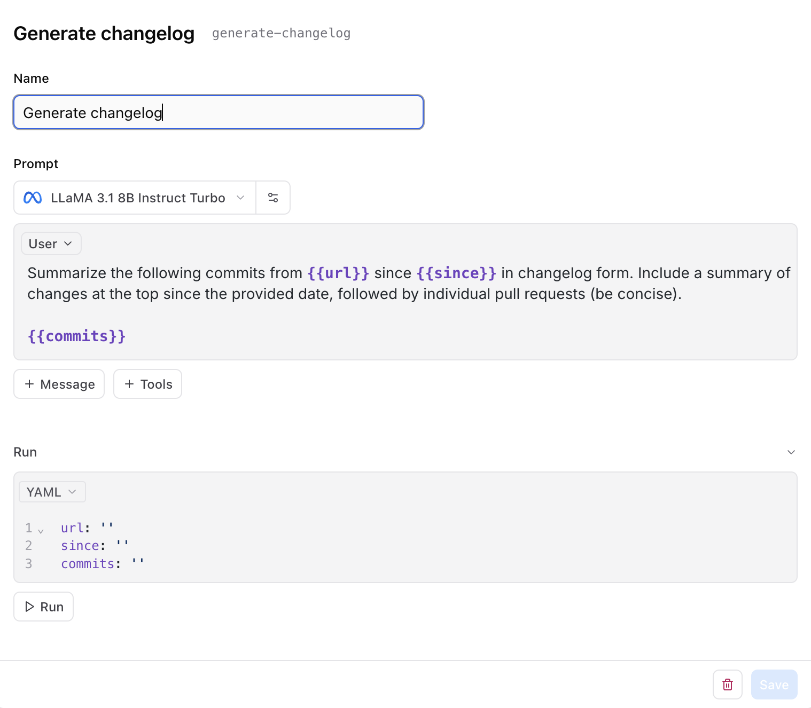
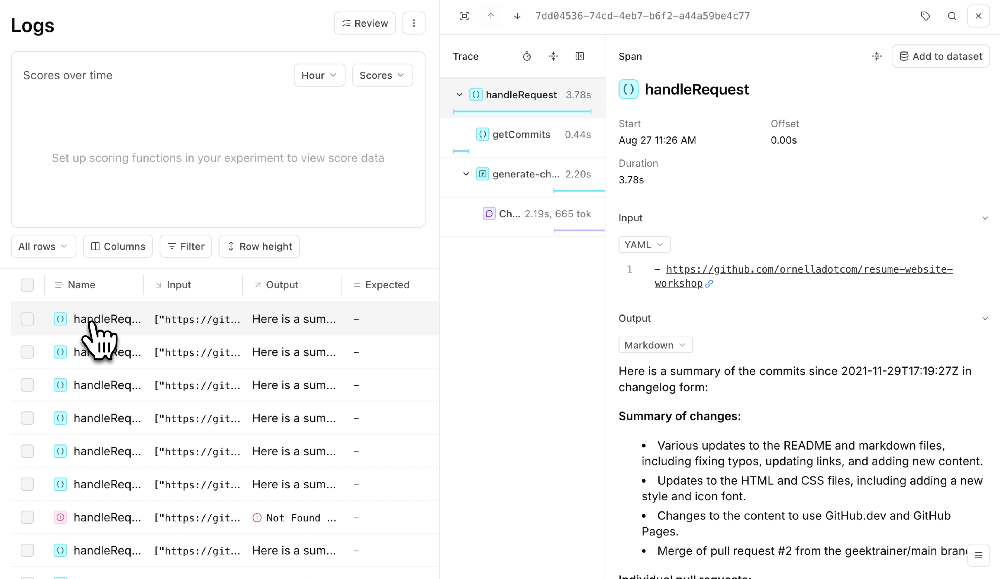

# Building products with AI

We're going to learn what it means to work with pre-built AI models, also known as foundation models, developed by companies like [OpenAI](https://openai.com/) and [Anthropic](https://www.anthropic.com/), and how to effectively use Braintrust to evaluate and improve your outputs. We'll be using a simple example throughout this guide, but the concepts you learn here can be applied to any AI product. 

By the end of this guide, you'll understand:
* Basic AI concepts
* How to prototype and evaluate a model's output
* How to build AI-powered products that scale effectively

# Understanding AI

Artificial intelligence (AI) is when a computer uses data to make decisions or predictions. Foundation models are pre-built AI systems that have already been trained on vast amounts of data. These models function like ready-made tools you seamlessly integrate into your projects, allowing them to understand text, recognize images, or generate content without requiring you to train the model yourself.

There are several types of foundation models, including those that operate on language, audio, and images. In this guide, we’ll focus on [large language models (LLMs)](https://en.wikipedia.org/wiki/Large_language_model), which understand and generate human language. They can answer questions, complete sentences, translate text, and create written content. They’re used for things like:

- Product descriptions for e-commerce
- Support chatbots and virtual assistants
- Code generation and help with debugging
- Real-time meeting summaries

Using AI can add significant value to your products by automating complex tasks, improving user experience, and providing insights based on data.

# Getting started

First, ensure you have [Node](https://nodejs.org/en/download/package-manager), [pnpm](https://pnpm.io/installation) (or the package manager of your choice), and [TypeScript](https://www.typescriptlang.org/download/) installed on your computer. This guide uses a pre-built sample project, [Unreleased AI](https://github.com/braintrustdata/unreleased-ai/tree/main), to focus on learning the concepts behind LLMs.

[Unreleased AI](https://github.com/braintrustdata/unreleased-ai/tree/main) is a simple web application that allows you to inspect commits from your favorite open-source repositories that have not been released yet, and generate a changelog that summarizes what's coming. It takes input from the user, the URL of a public GitHub repository, and uses AI to generate a changelog and output the commits since the last release. If there are no releases, it summarizes the 20 most recent commits. This application is useful if you’re a developer advocate or marketer, and want to communicate recent updates to users.

Typically, you would access LLMs through a model provider like OpenAI, Anthropic, or Google by making a request to their API. This request usually includes some prompt, or direction for the model to follow. To do so, you’d need to decide which provider’s model you’d like to use, obtain an API key, and then figure out how to call it from your code. But how do you decide which one is correct?

With Braintrust, you can test your code with multiple providers, and evaluate the responses so that you’re sure to choose the best model for your use case.

# Using AI models

## Setting up the project

Let’s dig into the sample project and walk through the workflow. Before we start, make sure you have a Braintrust account and [API key](https://www.braintrust.dev/app/settings?subroute=api-keys). You’ll also need to configure the individual API keys for each provider you want to test in your Braintrust [settings](https://www.braintrust.dev/app/braintrustdata.com/settings/secrets). You can start with just one, like [OpenAI](https://help.openai.com/en/articles/4936850-where-do-i-find-my-openai-api-key), and add more later on. After you complete this initial setup, you’ll be able to access the world's leading AI models in a unified way, through a single API.

1. Clone the [Unreleased AI](https://github.com/braintrustdata/unreleased-ai/tree/main) repo onto your machine. Create a `.env.local` file in the root directory. Add your Braintrust API key (`BRAINTRUST_API_KEY=...`). Now you can use your Braintrust API key to access all of the models from the providers you configured in your settings.
2. Run `pnpm install` to install the necessary dependencies and setup the project in Braintrust.
3. To run the app, run `pnpm dev` and navigate to `localhost:3000`. Type the URL of a public GitHub repository, and take note of the output.



## Working with Prompts in Braintrust

Navigate to Braintrust in your browser, and select the project named **Unreleased** that you just created. Go to the **Prompts** section and select the **Generate changelog** prompt. This will show you the model choice and the prompt used in the application:



A [prompt](https://www.braintrust.dev/docs/guides/prompts) is the set of instructions sent to the model, which can be user input or variables set within your code. For example:

- `url`: the URL of the public GitHub repository provided by the user
- `since`: the date of the last release of this repository, fetched by the GitHub API in [app/generate/route.ts](https://github.com/braintrustdata/unreleased-ai/blob/b611052e8a4705a098cbccbb71cdaa6cc18f2d35/app/generate/route.ts#L59)
- `commits`: the list of commits that have been published after the latest release, also fetched by the GitHub API in [app/generate/route.ts](https://github.com/braintrustdata/unreleased-ai/blob/b611052e8a4705a098cbccbb71cdaa6cc18f2d35/app/generate/route.ts#L76)

Creating effective prompts can be challenging. In Braintrust, you can edit your prompt directly in the UI and immediately see the changes in your application. For example, edit the **Generate changelog** prompt to include a friendly message at the end of the changelog:
> Summarize the following commits from `{{url}}` since `{{since}}` in changelog form. Include a summary of changes at the top since the provided date, followed by individual pull requests (be concise). At the end of the changelog, include a friendly message to the user.
>
>`{{commits}}`

Save the prompt, and it will be automatically updated in your your app – try it out! If you’re curious, you can also change the model here. The ability to iterate on and test your prompt is great, but writing a prompt in Braintrust is more powerful than that. Every prompt you create in Braintrust is also an AI function that you can invoke inside of your application.

## Running a prompt as a function

Running a prompt as an AI function is a faster and simpler way to iterate on your prompts and decide which model is right for your use case, and it comes out-of-the-box in Braintrust. Normally, you would need to choose a model upfront, hardcode the prompt text, and manage boilerplate code from various SDKs and observability tools. Once you create a prompt in Braintrust, you can invoke it with the arguments you created.

In [app/generate/route.ts](http://route.ts), the prompt is invoked with three arguments: `url`, `since`, and `commits`.

```typescript
return await invoke({  
    projectName: PROJECT_NAME,  
    slug: PROMPT_SLUG,  
    input: {  
        url,  
        since,  
        commits: commits.map(({ commit }) => \`${commit.message}\\n\\n\`),  
    },  
    stream: true,  
    });  
});
```

To set up streaming and make sure the results are easy to parse, just set `stream` to `true`. The result of the function call is then shown to the user in the frontend of the application.

Running a prompt as an AI function is also a powerful way to automatically set up other Braintrust capabilities. Behind the scenes, Braintrust automatically caches and optimizes the prompt through the [AI proxy](https://www.braintrust.dev/docs/guides/proxy) and logs it to your project, so you can dig into the responses and understand if you need to make any changes. This also makes it easy to change the model in the Braintrust UI, and automatically deploy it to any environment which invokes it.

## Observability

Traditional observability tools monitor performance and pipeline issues, but generative AI projects require deeper insights to ensure your application works as intended. As you continue using the application to generate changelogs for various GitHub repositories, you’ll notice every function call is [logged](https://www.braintrust.dev/docs/guides/logging), so you can examine the input and output of each call. 


You may notice that some outputs are better than others– so how can we optimize our application to have a great response every time? And how can we classify which outputs are good or bad?

## Scoring

To evaluate responses, we can create a custom scoring system. There are two main types of scoring functions: heuristics (best expressed as code) are great for well-defined criteria, while LLM-as-a-judge (best expressed as a prompt) is better for handling more complex, subjective evaluations. For this example, we’re going to define a prompt-based scorer.

To create a prompt-based scorer, you define a prompt that classifies its arguments, and a scoring function that converts the classification choices into scores. In [eval/comprehensiveness-scorer.ts](https://github.com/braintrustdata/unreleased-ai/blob/6e74be5caed1a1c368ee7124a5adc7e0c27f2969/eval/comprehensiveness-scorer.ts#L9), we defined our prompt as:

```typescript
const promptTemplate = `You are an expert technical writer who helps assess how effectively an open source product team generates a changelog based on git commits since the last release. Analyze commit messages and determine if the changelog is comprehensive, accurate, and informative. 

Input:  
{{input}}  

Changelog:  
{{output}}  

Assess the comprehensiveness of the changelog and select one of the following options. List out which commits are missing from the changelog if it is not comprehensive.  
a) The changelog is comprehensive and includes all relevant commits  
b) The changelog is mostly comprehensive but is missing a few commits  
c) The changelog includes changes that are not in commit messages  
d) The changelog is incomplete and not informative`;
```

Writing a prompt to use for these types of evaluations is difficult. In fact, it may take many iterations to come up with a prompt that you believe judges the output correctly. To refine this iteration process, you can even upload this prompt to Braintrust and call it as a function.

## Evals

Now, let’s use the comprehensiveness scorer to create a feedback loop that allows us to iterate on our prompt and make sure we’re shipping a reliable, high quality product. In Braintrust, you can run evaluations, or [Evals](https://www.braintrust.dev/docs/guides/evals/run), if you have a Task, Scores, and Dataset. We have a task, which is the invoke function we’re calling in our app. We have scores, the comprehensiveness function we just defined to assess the quality of our function outputs. The final piece we need to run evaluations is a [dataset](https://www.braintrust.dev/docs/guides/datasets).

### Datasets

Go to your Braintrust **Logs** and select the logs with undesirable outputs – maybe your input was invalid or not found, or maybe the output just wasn’t good enough. Use these logs to create a dataset called eval dataset, which we’ll evaluate for comprehensiveness to understand where the prompt might need adjustments. 


Alternatively, you can define a dataset in [eval/sampleData.ts](https://github.com/braintrustdata/unreleased-ai/blob/main/eval/sampleData.ts).

Now that we have all three inputs, we can establish an Eval() function in [eval/changelog.eval.ts](https://github.com/braintrustdata/unreleased-ai/blob/6e74be5caed1a1c368ee7124a5adc7e0c27f2969/eval/changelog.eval.ts#L26C1-L36C4):

```typescript
Eval(PROJECT_NAME, {  
    data: () => \[sampleData\],  
    task: async (input) =>  
    await invoke({  
        projectName: PROJECT_NAME,  
        slug: PROMPT_SLUG,  
        input,  
        schema: z.string(),  
    }),  
    scores: \[comprehensivessScorer\],  
});
```

In this function, `eval/sampleData.ts` is being used as the dataset. To use the dataset you created in Braintrust instead, change the `data` parameter to:

`initDataset({project: PROJECT_NAME, dataset: 'eval dataset'})`

Running `pnpm eval` will execute the evaluations defined in [changelog.eval.ts](https://github.com/braintrustdata/unreleased-ai/blob/main/eval/changelog.eval.ts) and log the results to Braintrust.

## Putting it all together


It’s time to [interpret your results](https://www.braintrust.dev/docs/guides/evals/interpret). Examine the comprehensiveness scores and other feedback generated by your evals. Based on these insights, you can make informed decisions on how to improve your application. If the results indicate that your prompt needs adjustment, you can tweak it directly in Braintrust’s UI until it consistently produces high-quality outputs. If tweaking the prompt doesn’t yield the desired results, consider experimenting with different models. You’ll be able to update prompts and models without redeploying your code, so you can make real-time improvements to your product. After making adjustments, re-run your evals to validate the effectiveness of your changes.

# Scaling with Braintrust
As you build more complex AI products, you’ll want to customize Braintrust even more for your use case. You might consider: 
* [Writing more specific evals](https://www.braintrust.dev/docs/guides/evals/write) or learning about [different scoring functions](https://www.braintrust.dev/docs/guides/evals/write)
* Walking through other examples of best practices for building high-quality AI products in the [Braintrust cookbook](https://www.braintrust.dev/docs/cookbook)
* Changing how you [log data](https://www.braintrust.dev/docs/guides/logging), including [incorporating user feedback](https://www.braintrust.dev/docs/guides/logging#user-feedback) 