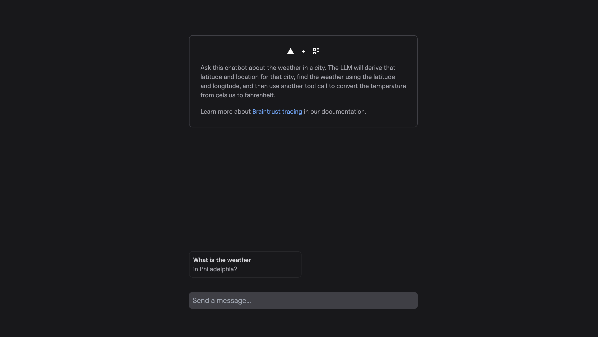
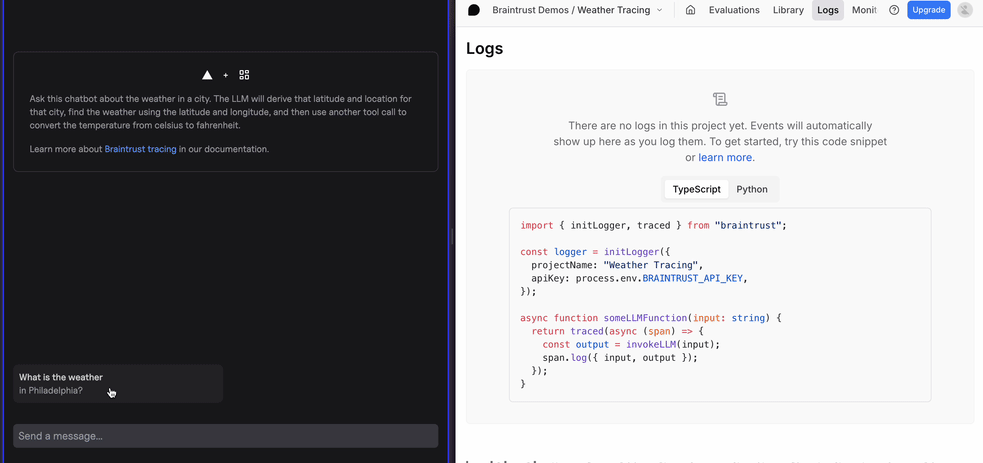
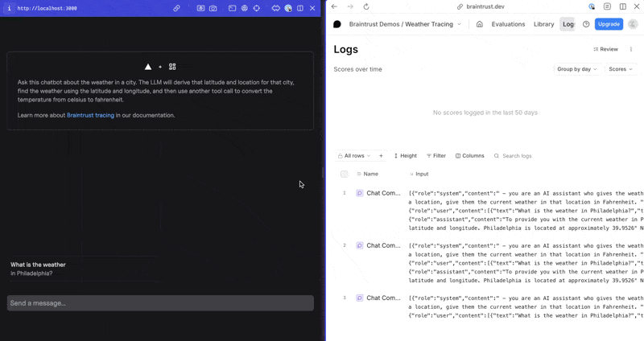
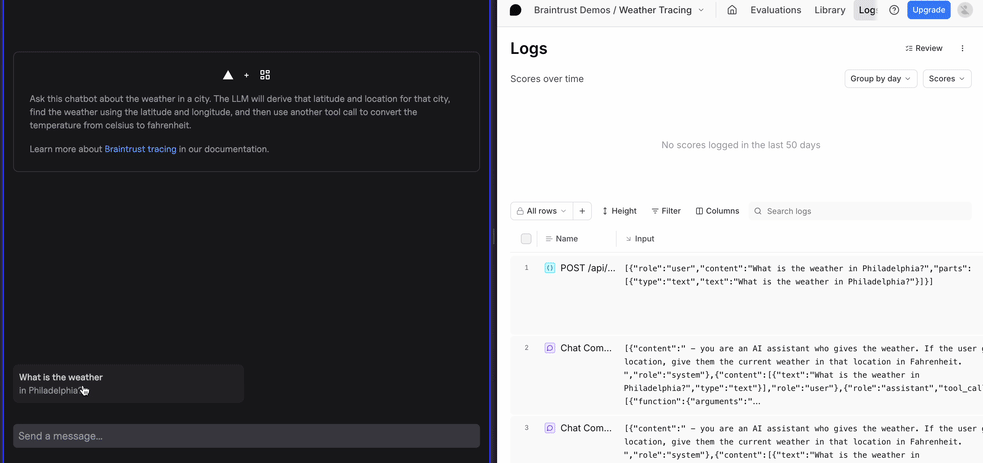

# Tracing Vercel AI SDK applications

The open-source [Vercel AI SDK](https://ai-sdk.dev/) is a popular choice for building generative AI applications due to its ease of use and integrations with popular frameworks, such as Next.js. However, builders recognize that to reach production, they also need to incorporate observability into their applications. This cookbook will show you how to use Braintrust's native integration with the Vercel AI SDK for logging and tracing a generative AI application.

## Getting started

To get started, make sure you have the following ready to go:

- A [Braintrust account](https://www.braintrust.dev/signup) and API key
- A [project](/docs/core/projects) in Braintrust
- An [OpenAI API key](https://platform.openai.com/)
- [`npm`](https://docs.npmjs.com/downloading-and-installing-node-js-and-npm) installed

In this cookbook, we're going to use a simple chat application that gives you the temperature when you ask about the weather in a given city. The chatbot uses an OpenAI model, which calls one tool that gets the weather from [open-meteo](https://open-meteo.com/) and another tool that converts the weather from Celsius to Fahrenheit.

Use `npx` to download the application locally:

```bash
npx create-next-app@latest --example https://github.com/braintrustdata/braintrust-cookbook/tree/main/examples/VercelAISDKTracing/complete-weather-app vercel-ai-sdk-tracing && cd vercel-ai-sdk-tracing
```

We'll only edit a few files in this example application:

```
complete-weather-app/
  |_ app/(preview)/api/chat/route.ts
  |_ components/tools.ts
  |_ .env.local
```

For the application to run successfully, you'll need to rename the `.env.local.example` file to `.env.local` in the root of the project and add the following environment variables:

```bash
BRAINTRUST_API_KEY="<Your Braintrust API Key>"
BRAINTRUST_PROJECT_NAME="<Your Braintrust Project Name>"
OPENAI_API_KEY="<Your OpenAI API Key>"
OTEL_EXPORTER_OTLP_ENDPOINT=https://api.braintrust.dev/otel
OTEL_EXPORTER_OTLP_HEADERS="Authorization=Bearer <Your Braintrust API Key>, x-bt-parent=project_id:<Your Braintrust Project Name>"
```

Run the application, and make sure you can access it at `http://localhost:3000`. Feel free to test the application by asking it about the weather in Philadelphia.

```bash
npm install
npm run dev
```

It should look like this:



## Tracing the application

### Initializing a logger

To send logs to Braintrust, you'll need to initialize a logger by calling the `initLogger` function. This function takes an `apiKey` and a `projectName` as arguments. The `apiKey` is your Braintrust API key, and the `projectName` is the name of your project in Braintrust. For lines 1-11 in the `app/(preview)/api/chat/route.ts` file, uncomment the lines where instructed to load the necessary Braintrust functions and initialize the logger. Lines 1-11 should look like this:

```typescript title="app/(preview)/api/chat/route.ts"
import { openai } from "@ai-sdk/openai";
import * as ai from "ai";
import { ToolInvocation } from "ai";
import { getWeather, getFahrenheit } from "@/components/tools";
// Uncomment below to use Braintrust's tracing features
import { initLogger, wrapAISDK, traced, currentSpan } from "braintrust";

// Initialize Braintrust as the logging backend. Uncomment below
const logger = initLogger({
  apiKey: process.env.BRAINTRUST_API_KEY,
  projectName: process.env.BRAINTRUST_PROJECT_NAME,
});
```

### Automatic tracing of AI SDK functions

The Braintrust SDK provides functions to "wrap" the Vercel AI SDK, automatically logging inputs and outputs. You can use the `wrapAISDK` function, which provides a unified interface that works across all AI SDK versions (v3, v4, v5, and v6 beta).

The `wrapAISDK` function wraps AI SDK functions like `streamText` and `generateText`, automatically tracing their inputs and outputs. It does not trace intermediary steps such as tool calls that may be invoked during execution. Later in the cookbook, we will explore how to use `wrapTraced` to trace tool calls and nested functions.

<Note>
  The `wrapAISDK` works with the Vercel AI SDK module. If you are not using the
  Vercel AI SDK and instead using a model provider's first-party library
  directly, you can [wrap your model
  clients](https://www.braintrust.dev/docs/guides/traces/customize#wrapping-llm-clients)
  with `wrapOpenAI` or `wrapAnthropic`.
</Note>

To correctly wrap the AI SDK in our weather app example, your code should look like this after uncommenting the proper lines:

```typescript title="app/(preview)/api/chat/route.ts"
// Any time streamText is called, the input and output will be logged to Braintrust.
const { streamText } = wrapAISDK(ai);
const model = openai("gpt-4o");
```

When we use the chatbot again, we see three logs appear in Braintrust: one log for the `getWeather` tool call, one log for the `getFahrenheit` tool call, and one call to form the final response. However, it'd probably be more useful to have all of these operations in the same log.



### Creating spans (and sub-spans)

When tracing events, it's common practice to place child events within a single parent event. As an example, take grouping the three logs that we produced above into the same log record. You can do this using the `traced` function.

To create a parent span in our weather app, uncomment the `traced` function (don't forget to uncomment the final line of code that closes the function). You can also uncomment the `onFinish` argument, which will log the input and output of the `streamText` function to the parent span. Your POST route should look like this when finished:

```typescript title="app/(preview)/api/chat/route.ts"
export async function POST(request: Request) {
  // traced starts a trace span when the POST endpoint is used
  // Unlike wrapTraced, traced does not natively log inputs and outputs. Uncomment below
  return traced(
    async (span) => {
      const { messages }: { messages: Message[] } = await request.json();

      const stream = await streamText({
        // Our wrapped OpenAI model
        model: model,
        system: `\
        - you are an AI assistant who gives the weather. If the user gives you a location, give them the current weather in that location in Fahrenheit.
      `,
        messages: messages,
        // Important: maxSteps prevents infinite tool call loops but will stop your LLM's logic prematurely if set too low
        maxSteps: 5,
        // Register the exported tools to the LLM from @/components/tools
        tools: {
          getWeather: getWeather,
          getFahrenheit: getFahrenheit,
        },
        // Enable experimental telemetry
        experimental_telemetry: {
          isEnabled: true,
        },
        // When streamText is finished, log the input and output of the stream for the "root" span. Uncomment below
        onFinish: (result) => {
          currentSpan().log({
            input: messages,
            output: result.text,
          });
        },
      });

      return stream.toDataStreamResponse();
    },
    // Show this span as a function and name the span POST /api/chat. Uncomment below
    { type: "function", name: "POST /api/chat" },
  );
}
```

After you uncomment those lines of code, you should see the following:



A couple of things happened in this step:

- We created a root span called "POST /api/chat" to group any subsequent logs into.
- We continued to create spans via the `wrapAISDK` function wrapping `streamText`.
- We used the `onFinish` argument of the `streamText` function to gather the input and output of the LLM and return it to the root span.

This looks good so far, but we also want to know about the different tool calls that the LLM is making as it works to form its response.

### Tracing tool calls

The last thing that we need to adjust is adding our tool calls and functions to the trace. You can do this by encapsulating existing functions with `wrapTraced`, which will automatically capture the inputs and outputs of the functions. When using `wrapTraced`, the hierarchy of nested functions is preserved.

The following code in `components/tools.ts` has two main components:

1. A `getFahrenheit` tool, which converts a Celsius temperature into Fahrenheit. It also nests the `checkFreezing` function inside the `convertToFahrenheit` function.
2. A `getWeather` tool which takes a latitude and longitude as input and returns a Celsius temperature as output.

Uncomment the code where noted so that your `tools.ts` file looks like this:

```typescript name="components/tools.ts"
import { tool } from "ai";
import { z } from "zod";
// Uncomment below to use Braintrust's tracing features
import { wrapTraced, currentSpan } from "braintrust";

interface LocationInput {
  latitude: number;
  longitude: number;
}

// Create a simple function to note whether or not a Fahrenheit temperature is freezing
// Wrap the function with the wrapTraced function to note inputs and outputs. Uncomment wrapTraced below
const checkFreezing = wrapTraced(
  async function checkFreezing({ fahrenheit }: { fahrenheit: number }) {
    return fahrenheit < 32;
  },
  // Uncomment below
  { type: "function" },
);

// Create a function that takes a temperature in Celsius and returns the temperature in Fahrenheit
// Wrap the function with the wrapTraced function to note inputs and outputs. Uncomment wrapTraced
const convertToFahrenheit = wrapTraced(
  async function convertToFahrenheit({ celsius }: { celsius: number }) {
    const fahrenheit = (celsius * 9) / 5 + 32;
    const isFreezing = checkFreezing({ fahrenheit });
    return fahrenheit;
  },
  // Uncomment below
  { type: "tool" },
);

// Construct a tool using the tool() function in the AI package to place in the LLM call
export const getFahrenheit = tool({
  description: "Convert Celsius to Fahrenheit",
  parameters: z.object({ celsius: z.number() }),
  execute: convertToFahrenheit,
});

// Create a function that fetches a temperature in Celsius from open-meteo
// Wrap the function with the wrapTraced function to note inputs and outputs. Note that the function should be logged as a tool in the trace. Uncomment wrapTraced below
const weatherFunction = wrapTraced(
  async function weatherFunction({ latitude, longitude }: LocationInput) {
    const response = await fetch(
      `https://api.open-meteo.com/v1/forecast?latitude=${latitude}&longitude=${longitude}&current=temperature_2m&hourly=temperature_2m&daily=sunrise,sunset&timezone=auto`,
    );
    const weatherData = await response.json();
    // Uncomment below to add metadata to the span
    currentSpan().log({
      metadata: { foo: "bar" },
    });
    return weatherData;
  },
  // Uncomment below
  { type: "tool", name: "weatherFunction" },
);

// Construct a tool using the tool() function in the AI package to place in the LLM call
export const getWeather = tool({
  description: "Get the current weather at a location",
  parameters: z.object({
    latitude: z.number(),
    longitude: z.number(),
  }),
  execute: weatherFunction,
});
```

After we finish uncommenting the correct lines, we see how the `wrapTraced` function enriches our trace with tool calls.



Take note of how the `type` argument in both `traced` and `wrapTraced` change the icon within the trace tree. Also, since `checkFreezing` was called by `weatherFunction`, the trace preserves the hierarchy.

## Next steps

- [Customize](/docs/guides/traces/customize) and [extend](/docs/guides/traces/extend) traces to better optimize for your use case
- Read more about [Brainstore](https://www.braintrust.dev/blog/brainstore), the database that powers the logging backend in Braintrust
